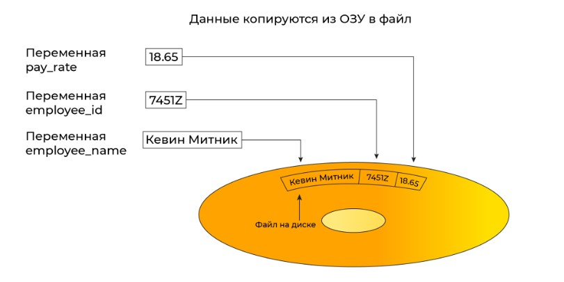
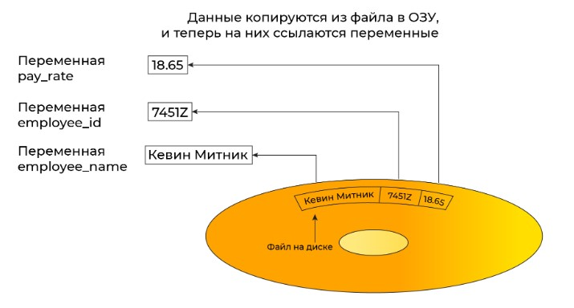
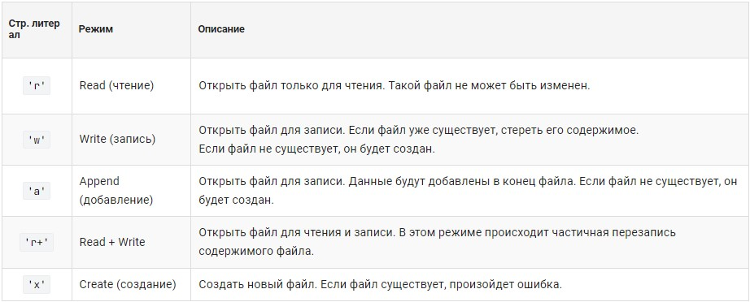
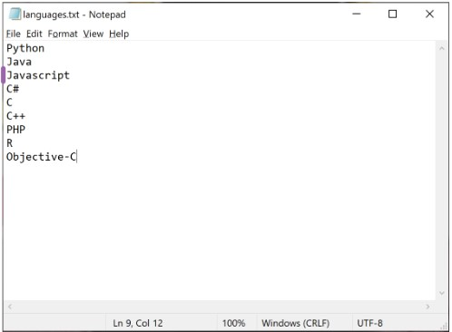
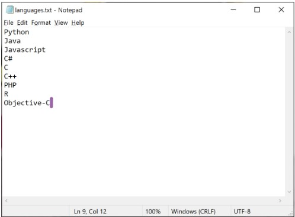

План изучения работы с файлами в Python

1. Основы работы с файлами

- Открытие и закрытие файлов:
  - Функция open(), режимы работы (r, w, a, b, x, +).
  - Использование контекстного менеджера (with).
- Чтение и запись файлов:
  - Методы read(), readline(), readlines().
  - Методы write() и writelines().
- Работа с позициями в файле:
  - Методы seek() и tell().

2. Работа с текстовыми файлами (TXT)

- Чтение и запись текстовых данных.
- Обработка больших файлов построчно.
- Пример использования для логов, хранения настроек.

3. Формат JSON (JavaScript Object Notation)

- Сериализация и десериализация:
  - Методы json.dump(), json.dumps(), json.load(), json.loads().
- Обработка сложных структур данных (вложенные списки и словари).
- Применение:
  - Хранение конфигураций, обмен данными через API.
- Библиотеки:
  - Встроенный модуль json.

4. Формат XML (eXtensible Markup Language)

- Парсинг XML:
  - Встроенная библиотека xml.etree.ElementTree.
  - Альтернативы: lxml (для расширенных возможностей), xmltodict (удобное преобразование в словари).
- Чтение, модификация и запись XML.
- Применение:
  - Конфигурационные файлы, обмен данными в сложных структурах.

5. Формат CSV (Comma-Separated Values)

- Чтение и запись CSV:
  - Методы модуля csv: csv.reader, csv.writer, DictReader, DictWriter.
  - Настройка разделителей и кавычек.
- Применение:
  - Табличные данные, обмен данными между системами.

6. Формат XLSX (Microsoft Excel)

- Основные библиотеки:
  - openpyxl для работы с Excel-файлами.
  - pandas для обработки табличных данных.
- Чтение, запись, создание таблиц и работа с листами.
- Применение:
  - Анализ данных, автоматизация отчетов.

7. Формат YAML (YAML Ain’t Markup Language)

- Библиотека PyYAML:
  - Методы yaml.dump() и yaml.load().
- Преимущества для конфигурационных файлов.

8. Формат PDF (Portable Document Format)

- Основные библиотеки:
  - PyPDF2 для чтения и разбиения PDF.
  - ReportLab для генерации PDF.
- Применение:
  - Создание отчетов, обработка документов.

9. Формат Pickle

- Сериализация и десериализация объектов:
  - Методы pickle.dump() и pickle.load().
- Особенности:
  - Используется для хранения Python-объектов (включая нестандартные типы данных).
- Применение:
  - Кэширование, сохранение промежуточных результатов работы.

10. Общие задачи при работе с файлами

- Чтение и запись данных.
- Поиск и замена текста.
- Парсинг файлов определенного формата.
- Конвертация данных между форматами.
- Автоматизация отчетов.

11. Обработка больших файлов

- Чтение файлов построчно для экономии памяти.
- Использование потоковой обработки (для XML, JSON).
- Библиотеки:
  - pandas для больших таблиц.
  - jsonlines для обработки JSON в потоковом режиме.

12. Советы по выбору библиотек и форматов

- Выбор формата в зависимости от задачи:
  - JSON для структурированных данных.
  - XML для сложных и иерархических структур.
  - XLSX для работы с табличными данными.
  - TXT для простых логов и данных.
- Использование сторонних библиотек для удобства.

Итог:

- Начать с базового ввода/вывода и TXT.
- Освоить JSON и CSV как самые востребованные форматы.
- Перейти к XML и XLSX для работы со сложными структурами и табличными данными.
- Изучить библиотеки для специфических форматов (PDF, Pickle).
- Понять применение больших файлов и потоковой обработки.


# Files Python
- Понятие файла
- Файловый ввод и вывод
- Работа с файлами
- Типы файлов
- Методы доступа к файлам
- Имена файлов
- Кодировка файлов

## Файловый ввод и вывод
Файл (англ. file) — именованная область данных на носителе информации.

Сохраненные в файле данные обычно остаются в нем после завершения работы программы, их можно позже извлечь и использовать.

Программисты называют такой процесс сохранения данных — запись данных в файл. Когда часть данных пишется в файл, она копируется из переменной, находящейся в оперативной памяти. Файл, куда сохраняются данные, называется файл вывода, потому что программа помещает в него выходные данные.



Процесс извлечения данных из файла называется чтением данных из файла. Данные считываются из файла ввода. Программа извлекает входные данные из этого файла. Когда порция данных считывается из файла, она копируется в оперативную память, где на нее ссылается переменная.



## Работа с файлами

- **Открыть файл**. В процессе открытия файла создается **связь между файлом и программой**. **Открытие файла вывода** обычно **создает файл на диске** и **позволяет программе записать в него данные**. **Открытие файла ввода позволяет программе прочитать данные из файла**.
- **Обработать файл**. На этом шаге **данные либо записываются в файл** (если это файл вывода), **либо считываются из файла** (если это файл ввода).
- **Закрыть файл**. **После использования файла программой его нужно закрыть**, тем самым освободить ресурс и разорвать связь файла с программой.

Файл, в который записываются данные, называется файлом вывода.
Файл, из которого данные считываются, называется файлом ввода
Прежде чем файл может использоваться программой, он должен быть открыт
Когда программа закончила использовать файл, она должна закрыть файл


## Типы файлов

**Существует два типа файлов**: **текстовые** и **двоичные** (**бинарные**).

**Текстовый файл** можно **открыть и просмотреть в текстовом редакторе**, таком как Блокнот.

**Двоичный файл содержит данные, которые не были преобразованы в текст**. Данные, которые помещены в двоичный файл, предназначены только для чтения программой, и такой файл невозможно просмотреть в текстовом редакторе.

Разделение файлов на текстовые и бинарные искусственное, так как любой текстовый файл бинарен.

## Методы доступа к файлам

Большинство языков программирования обеспечивает два способа получения доступа к данным в файле:
- последовательный,
- прямой или произвольный.

Последовательный, как при проигрывании кассет с записью на пленке, выдает порции информации одну за другой. При работе с таким файлом не получится перескочить сразу к нужной части данных, сначала придется прочитать все предыдущие. 

При работе с файлом с прямым или произвольным доступом можно перескочить непосредственно к любой порции данных, не читая предыдущие. Как проигрыватель компакт-дисков или МР3-плеер перескакивает сразу к любой песне.

## Имена файлов
Большинство пользователей компьютеров привыкли, что файлы определяются по имени. Когда создаете документ с помощью текстового редактора и сохраняете его в файле, указываете имя файла. Если исследуете содержимое диска с помощью проводника Windows, видите список имен файлов.

Например список файлов с именами Python.jpg, Записки.tхt и Резюме.dосх.

У каждой операционной системы собственные правила именования файлов. Многие системы поддерживают использование расширений файлов, т.е. коротких последовательностей символов, которые расположены в конце имени файла и предваряются точкой. Файлы, изображенные на рисунке, имеют расширения jpg, txt и docx. Расширение обычно говорит о типе данных в файле. Например, расширение jpg сообщает, что файл содержит графическое изображение, сжатое согласно стандарту JPEG. Расширение txt свидетельствует, что в файле текст. Расширение docx информирует о наличии в файле документа Microsoft Word.

## Кодировка файлов

Кодировка UTF-8 самая распространенная, рекомендуем использовать именно ее в качестве кодировки по умолчанию для текстовых файлов.

В операционной системе Windows до сих пор используется однобайтовая кодировка Windows-1251. Чтобы избежать проблем при работе с текстовыми файлами в Windows нужно явно указывать кодировку.

При работе с ОС Linux и MacOS таких проблем не возникает вовсе, поскольку в них кодировка UTF-8 применяется по умолчанию.

## Относительные и абсолютные пути

Путь файла (или путь к файлу) — последовательное указание имен папок, через которые надо пройти, чтобы добраться до объекта.

Пути к файлу бывают двух типов:
- абсолютные;
- относительные.

**Абсолютный путь – полный путь к файлу**, показывающий точное место его расположения. Он всегда один и тот же, пока файл не перемещен.

Примеры абсолютного пути:
- `D:\Data\MyFiles\picture.png;`
- `С:\MyPrograms\Python\script.py;`
- `C:\Users\timur\YandexDisk\BeeGeek\Python\book.pdf.`

**Относительный путь – привязан к какой-либо "отправной точке" и указан по отношению к ней.**

Например, у нас есть картинка picture.png, которая хранится на диске D. Абсолютный путь к ней будет `D:\Data\MyFiles\picture.png`, а относительно папки Data можно указывать `MyFiles\picture.png`.

# работа с текстовыми файлами, чтение данных
- Открытие и закрытие файлов
- Указание кодировки
- Чтение данных из файла

## Работа с файлами в Python
### Открытие файла
Для **открытия файлов** в Python существует **функция** `open()`. Она **создает файловый объект** и **связывает его с файлом на диске**. Общий формат применения функции open():
```
файловая_переменная = open(имя_файла, режим_доступа)
```
- **файловая переменная** – **имя переменной**, которая **ссылается на файловый объект**;
- **имя_файла** – **строковый литерал, задающий имя файла**;
- **режим_доступа** – **строковый литерал, задающий режим доступа** (`чтение`, `запись`, и т.д.), в котором файл будет открыт.

Cтроковые литералы (символы), используемые для задания режима доступа.



- **Открыть файл** `students.txt` для чтения:
```python
student_file = open('students.txt', 'r')
```

По умолчанию режим доступа определен для чтения, поэтому файл `students.txt` можно открыть для чтения так:
```python
student_file = open('students.txt')
```

В результате исполнения этой инструкции будет открыт файл students.txt и переменная student_file будет ссылаться на файловый объект, который можно использовать для чтения данных из файла.

Обратите внимание, что в переменную student_file в примере выше не попадает содержимое файла students.txt. Фактически это ссылка на файл, ее еще называют **дескриптор файла**.

- **Создать файл** с именем `sales.txt` и **записать в него данные о продажах**.
```python
sales_file = open('sales.txt', 'w')
```

### Указание места расположения файла

**Если имя файла не содержит путь, то используется относительный путь, относительно папки, где находится исполняемая программа.**

Когда в функцию open() передается имя файла без указания пути, интерпретатор Python исходит из предположения, что место расположения файла то же, что у исполняемой программы. Например, программа расположена в папке C:\Users\Documents\Python. Если программа выполняется и исполняет инструкцию:
```python
customer_file = open('customers.txt', 'r')
```

то файл customers.txt программа станет искать в папке C:\Users\Documents\Python.

Аналогично, если программа выполняется, и она исполняет инструкцию:
```python
sales_file = open('sales.txt', 'w')
```

то файл sales.txt создается в той же папке.

Если требуется **открыть файл, расположенный в другом месте**, нужно указать путь и имя файла в аргументе, передаваемом в функцию open().

Приведенный ниже код создает файл test.txt в папке C:\Users\temp:
```python
test_file = open('C:\\Users\\temp\\test.txt', 'w')
```

Обратите внимание: символ \ является специальным символом в Python и его нужно экранировать `(\\)`, чтобы интерпретатор Python рассматривал обратную косую черту как обычный символ.

Вместо экранирования символов можно использовать сырые строки (raw strings). Для этого следует снабдить строковый литерал префиксом в виде буквы r.

```python
test_file = open(r'C:\Users\temp\test.txt', 'w')
```

Приведенный выше код создает файл test.txt в папке C:\Users\temp. Префикс r указывает на то, что строковый литерал является сырым (неформатированным).

### Кодировка

Открыть файл, содержащий только латиницу и цифры, можно так:
```python
file = open('info.txt', 'r')
```
При работе с текстом на русском языке нужно указать кодировку, для этого служит параметр encoding:
```python
file = open('info.txt', 'r', encoding='utf-8')
```
Указание кодировки при открытии файла – хороший тон. Рекомендуем придерживаться этого правила.

Чтобы получить кодировку открытого файла, используют файловое свойство encoding.
```python
file1 = open('students.txt', 'w')
file2 = open('customers.txt', 'w', encoding='utf-8')

print(file1.encoding)
print(file2.encoding)

file1.close() # cp1252
file2.close() # utf-8
```

### Закрытие файлов

После окончания работы с файлом его необходимо закрыть. Для этого есть несколько причин:

- если файл изменялся, это позволит корректно его сохранить;
- если открытый файл потребуется другим программам, ваша программа может его блокировать;
- не стоит держать в памяти лишние, уже не нужные данные;
- удалить открытый кем-то файл проблематично.

Для закрытия файла используется файловый метод close():
```python
file = open('info.txt', 'r')    # открываем файл с именем info.txt для чтения

                                # работаем с содержимым файла info.txt

file.close()                    # закрываем файл после окончания работы
```

Чтобы проверить открыт файл или закрыт можно использовать файловое свойство (атрибут) closed.

```python
file1 = open('students.txt', 'w')
file2 = open('customers.txt', 'w')

file1.close()

print(file1.closed) # True
print(file2.closed) # False

file2.close()
```

Обратите внимание на то, что при вызове метода мы используем скобки: close(), а при вызове свойства (атрибута) скобок нет closed. Методы совершают действия, а свойства возвращают информацию об объекте

### Чтение содержимого файла

при открытии файла с помощью функции open() в файловую переменную попадает не содержимое файла, а ссылка на файл (дескриптор файла).

```python
file = open('info.txt', 'w', encoding='utf-8')    # открываем файл для записи

print(file) # <_io.TextIOWrapper name='info.txt' mode='w' encoding='utf-8'>
```

Для чтения содержимого открытого для чтения файла используются три файловых метода:
- `read()` – **читает все содержимое файла**;
- `readline()` – **читает одну строку из файла**;
- `readlines()` – **читает все содержимое файла и возвращает список строк**.


### Метод read()

Предположим, в папке с исполняемой программой есть текстовый файл languages.txt с содержимым:
```
Python
Java
Javascript
C#
C
C++
PHP
R
Objective-C
```
Файловый метод read() считывает все содержимое из файла и возвращает строку, которая может содержать символы перехода на новую строку '\n'.

```python
file = open('languages.txt', 'r', encoding='utf-8')

content = file.read()

file.close() # 'Python\nJava\nJavascript\nC#\nC\nC++\nPHP\nR\nObjective-C'
```

Таким образом, метод read() считывает все содержимое файла, включая переносы строк:

Если методу read() передать целочисленный параметр, то будет считано не более заданного количества символов. Например, считывать файл посимвольно можно при помощи метода read(1).

### Метод readline()

Файловый метод readline() считывает одну строку из файла (до символа конца строки '\n'), при этом возвращается считанная строка вместе с символом '\n'. Если считать строку не удалось – достигнут конец файла и больше строк в нем нет, возвращается пустая строка.

```python
file = open('languages.txt', 'r', encoding='utf-8')

language = file.readline()

file.close()
```

считывает содержимое первой строки файла languages.txt в переменную language. В переменной language будет содержаться строка 'Python\n'.

Для удаления символа '\n' из конца считанной строки удобно использовать строковый метод rstrip().

```python
line = 'Python\n'
line = line.rstrip()
```

Прочитать содержимое всего файла построчно можно двумя способами.

- С помощью цикла while:
```python
file = open('languages.txt', 'r', encoding='utf-8')

line = file.readline()         # считываем первую строку

while line != '':              # пока не конец файла
    print(line.strip())        # обрабатываем считанную строку
    line = file.readline()     # читаем новую строку

file.close()
```

- С помощью цикла for (предпочтительный вариант):
```python
file = open('languages.txt', 'r', encoding='utf-8')

for line in file:
    print(line.strip())
    
file.close()
```

Метод readline() довольно удобен, когда мы хотим управлять процессом чтения из файла, особенно если файл очень большой и его полное считывание может привести к нехватке памяти.

### Метод readlines()

Файловый метод readlines() считывает все строки из файла и возвращает список из всех считанных строк (одна строка — один элемент списка). При этом, каждая строка в списке заканчивается символом переноса строки  '\n'

```python
file = open('languages.txt', 'r', encoding='utf-8')

languages = file.readlines()

file.close()
```

считывает содержимое файла languages.txt в переменную languages. В переменной languages будет содержаться список:

```python
['Python\n', 'Java\n', 'Javascript\n', 'C#\n', 'C\n', 'C++\n', 'PHP\n', 'R\n', 'Objective-C']
```

- Чтобы удалить символ '\n' можно использовать списочное выражение:

```python
languages = [line.strip() for line in file.readlines()]
```

- либо функцию map()

```python
languages = list(map(str.strip, file.readlines()))
```

- либо анонимную функцию:

```python
languages = list(map(lambda line: line.strip(), file.readlines()))
```

### Позиция в файле

Вызов методов read(), readlines(), readline() перемещает текущую позицию туда, где завершилось чтение. Для методов read() и readlines() это конец файла, для метода readline() – следующая строка после прочитанной.

Текущую позицию обычно называют **"курсор"**. 

Когда мы его открываем, курсор находится в начале файла, в нулевой позиции.


Если мы считаем две строки с помощью метода readline() курсор переместится в начало третьей строки:

```python
file = open('languages.txt', 'r', encoding='utf-8')
line1 = file.readline()
line2 = file.readline()

file.close()
```



Чтение всегда происходит слева направо от курсора. Таким образом, если после двух вызовов метода readline() вызвать метод read(), он считает не весь файл, а только оставшиеся строки:

```python
file = open('languages.txt', 'r', encoding='utf-8')
line1 = file.readline()
line2 = file.readline()
remaining_lines = file.read()    # считывание начинается с 3 строки до конца файла

file.close()
```

После того, как мы считали все строки файла, курсор находится в конце.



После завершения чтения мы больше не можем считать ни одного символа из файла. Все последующие вызовы методов read() или readline() будут приводить к считыванию пустой строки.

Для повторного чтения данных из файла, можно:
- переоткрыть файл, тогда курсор снова попадёт в начало;
- переместить курсор с помощью файлового метода `seek()`.

### Файловый метод seek()

Файловый метод `seek()` задаёт позицию курсора в байтах от начала файла. Чтобы перевести курсор в самое начало файла необходимо вызвать метод seek(), передав ему в качестве аргумента значение 0.

```python
file = open('languages.txt', 'r', encoding='utf-8')
line1 = file.readline()
file.seek(0)               # переводим курсор в самое начало
line2 = file.readline()

print(line1, line2) 

# Вывод:
# Python
# Python

file.close()
```

Метод seek() не очень полезен при работе с текстовыми файлами, так как не учитывает разделение текста на строки. А вот при работе с файлами в двоичном режиме умение работать с позицией и смещениями очень важно!

Будьте аккуратны с символами, использующими более 1 байта (кириллица в кодировке utf-8), обращение к "промежуточному" байту может вызвать ошибку.

Если метод seek() устанавливает курсор (текущую позицию), то метод tell() получает ее.

```python
file = open('languages.txt', 'r', encoding='utf-8')
print(file.tell())
line1 = file.readline()
print(file.tell())

# Вывод:
# 0
# 8

file.close()
```

### Менеджер контекста

Менеджер контекста — объект, реализующий одноименный протокол. Объекты, реализующие этот протокол, позволяют использовать следующий специальный синтаксис:

```python
with object as name:
    # Здесь нам доступен ресурс name.
    # Это тело with-блока.
# А здесь ресурс name уже освобождён, даже если в теле with-блока произошла ошибка.
```

Весь код в теле with-блока работает "в контексте". Чаще всего контекст подразумевает выделение некоего ресурса, например, файла. По выходу из контекста ресурс автоматически освобождается, даже если при выполнении блока возникло исключение.

Как только закончится код, оформленный с отступами в with (аналогичные отступы в циклах или функциях), это будет означать, что контекст закончился, и Python автоматически закроет файл.

```python
with open('languages.txt', 'r', encoding='utf-8') as file:
    for line in file:
        print(line)
                          # автоматическое закрытие файла
print('Файл закрыт')
```

При работе с файлами желательно всегда использовать менеджер контекста. Это делает программу надежнее.

С помощью менеджера контекста можно работать с несколькими файлами.

```python
with open('input.txt', 'r') as input_file, open('output.txt', 'w') as output_file:
    # обработка файлов
```

### Запись данных в файлы

Для записи используются два файловых метода:

- `write()` – записывает переданную строку в файл;
- `writelines()` – записывает переданный список строк в файл.

### Метод `write()`
Рассмотрим текcтовый файл myfile.txt, содержащий следующие строки:

```
First line of the file.
Second line of the file.
Third line of the file.
```

Если файл открыт в режиме 'w', то его содержимое сначала полностью стирается, а уже затем в него добавляются данные.

После выполнения следующего кода:
```python
with open('myfile.txt', 'w', encoding='utf-8') as file:
    file.write('Python and beegeek forever\n')
    file.write('We love stepik <3')
```

файл myfile.txt будет содержать:
```
Python and beegeek forever
We love stepik <3
```

Если файл открыт в режиме 'a', то запись происходит в самый конец файла.

После выполнения следующего кода:

```python
with open('myfile.txt', 'a', encoding='utf-8') as file:
    file.write('Python and beegeek forever\n')
    file.write('We love stepik <3')
```

файл myfile.txt будет содержать:
```
First line of the file.
Second line of the file.
Third line of the file.Python and beegeek forever
We love stepik <3
```

Если файл открыт в режиме 'r+', то происходит частичная перезапись его содержимого.

После выполнения следующего кода:

```python
with open('myfile.txt', 'r+', encoding='utf-8') as file:
    file.write('Python and beegeek forever\n')
    file.write('We love stepik.')
```

файл myfile.txt будет содержать:
```
Python and beegeek forever
We love stepik. file.
Third line of the file.
```

### Метод writelines()

Последовательные вызовы метода write() дописывают текст в конец файла.

На практике часто приходится записывать в файл содержимое целого списка. Это можно сделать с помощью цикла или метода writelines(), что удобнее. Метод writelines() принимает в качестве аргумента список строк и записывает его в файл.

Приведенный ниже код создает файл philosophers.txt и записывает в него содержимое списка philosophers:
```python
philosophers = ['Джoн Локк\n', 'Дэвид Хьюм\n', 'Эдмyнд Берк\n']

with open('philosophers.txt', 'w', encoding='utf-8') as file:
    file.writelines(philosophers)
```

Файловые методы write() и writelines() не добавляют переход на новую строку, поэтому для перехода на новую строку в файле необходимо явно добавить символ '\n'.

### Запись в файл с помощью функции print()

Для записи данных в файл можно также использовать встроенную функцию print(). Для этого нужно передать ей еще один именованный аргумент file, указывающий на открытый файл. При этом функция print() автоматически добавляет переход на новую строку.

Приведенный ниже код:

```python
with open('philosophers.txt', 'w', encoding='utf-8') as output:
    print('Джoн Локк', file=output)
    print('Дэвид Хьюм', file=output)
    print('Эдмyнд Берк', file=output)
```

создает файл philosophers.txt с содержимым:
```
Джoн Локк
Дэвид Хьюм
Эдмyнд Берк
```

Мы можем использовать всю мощность встроенной функции print() для форматирования выводимого текста.

Приведенный ниже код:
```python
with open('philosophers.txt', 'w', encoding='utf-8') as output:
    print('Джoн Локк', 'Дэвид Хьюм', 'Эдмyнд Берк', sep='***', file=output)
```
создает файл philosophers.txt с содержимым:
```
Джoн Локк***Дэвид Хьюм***Эдмyнд Берк
```