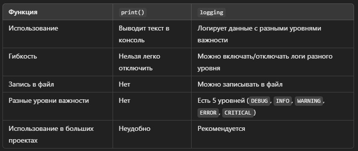

# логирования в Python

Логирование – это процесс записи событий во время работы программы. В Python для этого используется встроенный модуль logging.

Чтобы глубоко разобраться в теме, я подготовил подробный план изучения, который охватывает все аспекты логирования: от базовых понятий до продвинутых техник, включая кастомные обработчики, форматирование и асинхронное логирование.

# 📌 План изучения логирования в Python
## 1. Введение в логирование
Что такое логирование и зачем оно нужно?
Разница между print() и logging
Какие события стоит логировать в коде?
Основные уровни логирования (DEBUG, INFO, WARNING, ERROR, CRITICAL)
Практика:
✅ Установить модуль logging и вывести первое лог-сообщение.
✅ Попробовать разные уровни логов.

## 2. Базовая настройка модуля logging
Функция logging.basicConfig()
Запись логов в консоль
Использование logging.getLogger()
Параметры: level, format, filename, filemode
Различные способы вывода логов: в терминал, в файл
Практика:
✅ Написать код, который логирует события разного уровня.
✅ Записать логи в файл.

## 3. Форматирование логов
Использование format в basicConfig
Основные переменные форматирования (asctime, name, levelname, message)
Настройка времени в логах (datefmt)
Разница между %-форматированием и str.format()
Использование logging.Formatter
Практика:
✅ Настроить логирование с кастомным форматом, включающим дату, уровень и сообщение.

## 4. Логирование в ООП (применение в классах)
Использование self.logger = logging.getLogger(__name__) в классах
Как сделать так, чтобы разные модули имели свой логгер
Глобальный логгер vs Логгер в конкретных классах
Передача логгера по иерархии
Практика:
✅ Добавить логирование в классы Employee и Manager, записывать информацию при создании объекта и вызове get_bonus.

## 5. Обработчики (Handlers)
Что такое обработчики и зачем они нужны?
Виды обработчиков:
StreamHandler (консоль)
FileHandler (файл)
RotatingFileHandler (лог-файлы с ограниченным размером)
TimedRotatingFileHandler (лог-файлы, создаваемые по времени)
Логирование в несколько мест одновременно
Практика:
✅ Сделать так, чтобы логи записывались и в консоль, и в файл одновременно.
✅ Использовать RotatingFileHandler для управления размером лог-файлов.

## 6. Фильтрация логов (Filters)
Фильтрация сообщений по уровню (setLevel())
Использование logging.Filter
Как логировать только нужные сообщения
Практика:
✅ Создать фильтр, который пропускает только WARNING и выше.
✅ Реализовать кастомный фильтр, логирующий только определённые классы.

## 7. Передовой уровень: кастомные обработчики и форматтеры
Создание своих обработчиков (CustomHandler)
Написание кастомных Formatter для гибкого форматирования
Добавление цветных логов в консоль с помощью библиотеки colorlog
Практика:
✅ Сделать цветное логирование в консоли.
✅ Создать обработчик, который отправляет ошибки на email.

## 8. Логирование ошибок и исключений
Как правильно логировать ошибки с try-except
Использование logging.exception()
Запись стека ошибок (exc_info=True)
Практика:
✅ Перехватывать ошибки в get_bonus() и логировать их.

## 9. Асинхронное логирование (если нужно)
Как логировать в многопоточных программах
Использование QueueHandler
Логирование в asyncio
Практика:
✅ Запуск нескольких потоков и проверка корректного логирования.

## 10. Логирование в реальных проектах
Где и какие логи стоит писать в крупных системах?
Интеграция с loguru (альтернативная библиотека)
Использование логирования в Django / Flask
Отправка логов в ELK (Elasticsearch, Logstash, Kibana) и мониторинг
Практика:
✅ Настроить loguru в небольшом проекте.
✅ Добавить отправку логов в Telegram.

## Что делать дальше?
Пройти все пункты плана, написав код для каждого раздела.
Добавить логирование в свой проект по ООП.
Ознакомиться с библиотекой loguru для продвинутого логирования.


# Урок 1: Введение в логирование в Python

В этом уроке мы разберёмся, что такое логирование, зачем оно нужно, как оно отличается от `print()`, какие события стоит логировать и какие уровни логирования существуют.
Также будут примеры кода и небольшие практические задания.

## 1. Что такое логирование и зачем оно нужно?
**Логирование** — это процесс записи важных событий, происходящих в программе во время её работы.

### Где используется логирование?
- **Отладка программ**: помогает понять, где именно произошла ошибка.
- **Запись ошибок в файл**: полезно, если программа работает долго (например, серверное приложение).
- **Мониторинг работы программы**: можно анализировать, как пользователи взаимодействуют с программой.
- **Улучшение безопасности**: можно фиксировать подозрительные действия.
- **Пример использования логирования**: Допустим, у нас есть функция, которая рассчитывает зарплату сотрудника. Мы хотим понять, почему программа работает неправильно.

### **Код без логирования (использует print)**:

```python
def calculate_salary(hours_worked, rate_per_hour):
    print("Функция calculate_salary вызвана")  # Просто сообщение в консоли
    salary = hours_worked * rate_per_hour
    print("Рассчитанная зарплата:", salary)
    return salary

calculate_salary(40, 15)
```
### **Проблемы с таким подходом**:

- `print()` выводит данные только в консоль, их нельзя легко сохранить в файл.
- Нельзя настроить уровень важности сообщений.
- Невозможно легко отключить print() в продакшене.

### **Код с логированием (logging)**

```python
import logging

logging.basicConfig(level=logging.INFO)  # Устанавливаем уровень логирования
logger = logging.getLogger(__name__)  # Создаём логгер

def calculate_salary(hours_worked, rate_per_hour):
    logger.info("Функция calculate_salary вызвана")
    salary = hours_worked * rate_per_hour
    logger.info(f"Рассчитанная зарплата: {salary}")
    return salary

calculate_salary(40, 15)
```
### Преимущества:

- `logging` позволяет настраивать уровни логов.
- Можно записывать логи в файл или другие системы мониторинга.
- Легко отключить логи, не изменяя код.

## 2. Разница между `print()` и `logging`


### Пример: заменяем print() на logging
**Плохой код с `print()`**:

```python
def divide(a, b):
    print("Функция divide вызвана")
    if b == 0:
        print("Ошибка: деление на ноль!")
        return None
    result = a / b
    print(f"Результат деления: {result}")
    return result

divide(10, 2)
divide(5, 0)
```
**Хороший код с `logging`**:

```python
import logging

logging.basicConfig(level=logging.INFO)
logger = logging.getLogger(__name__)

def divide(a, b):
    logger.info("Функция divide вызвана")
    if b == 0:
        logger.error("Ошибка: деление на ноль!")
        return None
    result = a / b
    logger.info(f"Результат деления: {result}")
    return result

divide(10, 2)
divide(5, 0)
```
Вывод логов:

```makefile
INFO:__main__:Функция divide вызвана
INFO:__main__:Результат деления: 5.0
INFO:__main__:Функция divide вызвана
ERROR:__main__:Ошибка: деление на ноль!
```
**Разница: с `print()` ошибки теряются в потоке сообщений, а `logging` выделяет ошибки (`ERROR`) и важные события (`INFO`).**

## 3. Какие события стоит логировать в коде?
Нужно логировать:

- **Ошибки и исключения (`ERROR`)**
- **Важные изменения в системе (`CRITICAL`)**
- **Запуск и завершение ключевых процессов (`INFO`)**
- **Подозрительные действия (`WARNING`)**
- **Подробные данные для отладки (`DEBUG`)**

## 4. Основные уровни логирования
- `DEBUG`	Подробная отладочная информация.	Разработка
- `INFO`	Информационные сообщения.	Обычная работа программы
- `WARNING`	Предупреждения о возможных проблемах,	Ошибки, которые не критичны
- `ERROR`	Ошибки, которые привели к сбоям,	Ошибки, требующие исправления
- `CRITICAL`	Критические ошибки.	Поломка всей программы

**Пример использования всех уровней**

```python
import logging

logging.basicConfig(level=logging.DEBUG)  # Уровень логирования

logger = logging.getLogger(__name__)

logger.debug("Это сообщение уровня DEBUG (отладка)")
logger.info("Это сообщение уровня INFO (информация)")
logger.warning("Это сообщение уровня WARNING (предупреждение)")
logger.error("Это сообщение уровня ERROR (ошибка)")
logger.critical("Это сообщение уровня CRITICAL (критическая ошибка)")
```
**Вывод**:

```vbnet
DEBUG:__main__:Это сообщение уровня DEBUG (отладка)
INFO:__main__:Это сообщение уровня INFO (информация)
WARNING:__main__:Это сообщение уровня WARNING (предупреждение)
ERROR:__main__:Это сообщение уровня ERROR (ошибка)
CRITICAL:__main__:Это сообщение уровня CRITICAL (критическая ошибка)
```
**Обратите внимание: уровень `DEBUG` виден только, если `level=logging.DEBUG`**. 

Если поставить level=logging.WARNING, сообщения DEBUG и INFO не отобразятся.

## Задания для практики
### Задание 1:
Создайте программу, которая принимает два числа и выполняет деление.
- Используйте logging вместо print()
- Логируйте ошибки, если происходит деление на ноль

### Задание 2:
Напишите функцию authenticate(user, password), которая проверяет логин и пароль.
- Логируйте входящие данные (без пароля!)
- Если пароль неверный – записывать WARNING, если правильный – INFO.

## Итог урока
- print() не подходит для больших программ, нужен logging.
- Логирование позволяет записывать события в консоль и файлы.
- В Python есть 5 уровней логов: DEBUG, INFO, WARNING, ERROR, CRITICAL.
- Можно гибко настраивать, какие логи видеть.
- Логирование упрощает отладку и повышает безопасность.

# Урок 2: Базовая настройка модуля logging в Python
В этом уроке мы разберём, как правильно настраивать логирование в Python, чтобы логи были удобными и информативными.

## 1. Функция logging.basicConfig()
Функция logging.basicConfig() позволяет задать:
- Минимальный уровень логов (level)
- Формат вывода сообщений (format)
- Запись в файл (filename)
- Режим работы с файлом (filemode)

**Простой пример `basicConfig()`**
```python
import logging

logging.basicConfig(level=logging.DEBUG)
logging.debug("Это сообщение уровня DEBUG")
logging.info("Это сообщение уровня INFO")
logging.warning("Это сообщение уровня WARNING")
logging.error("Это сообщение уровня ERROR")
logging.critical("Это сообщение уровня CRITICAL")
```
**Вывод**:

```vbnet
DEBUG:root:Это сообщение уровня DEBUG
INFO:root:Это сообщение уровня INFO
WARNING:root:Это сообщение уровня WARNING
ERROR:root:Это сообщение уровня ERROR
CRITICAL:root:Это сообщение уровня CRITICAL
```
**Разбор кода**:

- **Мы установили level=logging.DEBUG, поэтому отображаются все сообщения**.
- **Если бы мы установили level=logging.WARNING, то DEBUG и INFO не появились бы в выводе**.
## 2. Запись логов в консоль
По умолчанию `logging` выводит сообщения в консоль. Мы можем настроить формат логов.

**Настройка формата вывода**
```python
import logging

logging.basicConfig(
    level=logging.INFO,
    format="%(asctime)s - %(levelname)s - %(message)s"
)

logging.info("Программа запущена")
logging.warning("Это предупреждение")
logging.error("Произошла ошибка")
```
Вывод:

```yaml
2025-01-30 12:34:56,789 - INFO - Программа запущена
2025-01-30 12:34:56,789 - WARNING - Это предупреждение
2025-01-30 12:34:56,789 - ERROR - Произошла ошибка
```
**Разбор формата `format`**:

- `%(asctime)s` – время записи лога
- `%(levelname)s` – уровень логирования (`INFO`, `WARNING`, `ERROR`)
- `%(message)s` – текст сообщения
## 3. Использование logging.getLogger()
Зачем нужен `getLogger()`? По умолчанию `logging` использует `root-логгер`, но в больших программах лучше создавать именованные логгеры.

**Пример без `getLogger()`**:

```python
import logging

logging.basicConfig(level=logging.INFO)
logging.info("Сообщение от root-логгера")
```
**Пример с `getLogger()`**:

```python
import logging

logging.basicConfig(level=logging.INFO)
logger = logging.getLogger("my_logger")  # Создаём логгер с именем

logger.info("Сообщение от my_logger")
```
**Разница**:

- `root-логгер` – общий логгер
- `getLogger("my_logger")` – позволяет делать разные логгеры для разных частей программы
## 4. Параметры basicConfig()
### 1. level – уровень логов
Определяет, какие сообщения будут отображаться.

Значение	Какие логи выводятся
DEBUG	Все логи
INFO	INFO, WARNING, ERROR, CRITICAL
WARNING	WARNING, ERROR, CRITICAL
ERROR	ERROR, CRITICAL
CRITICAL	Только CRITICAL
Пример:

python
Копировать
Редактировать
logging.basicConfig(level=logging.WARNING)
logging.info("INFO не будет видно")
logging.warning("WARNING будет видно")
### 2. format – формат вывода сообщений
Можно настроить, как будут выглядеть логи.

Пример со временем, уровнем и именем файла:

python
Копировать
Редактировать
logging.basicConfig(format="%(asctime)s - %(levelname)s - %(filename)s - %(message)s")
Вывод:

yaml
Копировать
Редактировать
2025-01-30 12:34:56,789 - INFO - my_script.py - Программа запущена
### 3. filename – запись логов в файл
Можно настроить логирование не только в консоль, но и в файл.

Пример записи логов в файл:

python
Копировать
Редактировать
logging.basicConfig(filename="app.log", level=logging.INFO)
logging.info("Программа запущена")
После выполнения программы в файле app.log будет запись:

css
Копировать
Редактировать
INFO:root:Программа запущена
### 4. filemode – режим записи в файл
"w" – каждый запуск программы перезаписывает файл
"a" – новые логи добавляются в конец файла
Пример: перезаписывать файл при каждом запуске

python
Копировать
Редактировать
logging.basicConfig(filename="app.log", filemode="w", level=logging.INFO)
logging.info("Программа запущена")
### 5. Различные способы вывода логов
Вывод в терминал и в файл одновременно
Иногда нужно логировать одновременно и в файл, и в консоль.

python
Копировать
Редактировать
import logging

# Создаём логгер
logger = logging.getLogger("my_logger")
logger.setLevel(logging.DEBUG)

# Вывод в консоль
console_handler = logging.StreamHandler()
console_handler.setLevel(logging.DEBUG)

# Вывод в файл
file_handler = logging.FileHandler("app.log", mode="a")
file_handler.setLevel(logging.INFO)

# Формат логов
formatter = logging.Formatter("%(asctime)s - %(levelname)s - %(message)s")
console_handler.setFormatter(formatter)
file_handler.setFormatter(formatter)

# Добавляем обработчики
logger.addHandler(console_handler)
logger.addHandler(file_handler)

# Логируем
logger.debug("Это DEBUG сообщение")
logger.info("Это INFO сообщение")
logger.warning("Это WARNING сообщение")
logger.error("Это ERROR сообщение")
logger.critical("Это CRITICAL сообщение")
Вывод:

В консоли отобразятся все уровни (DEBUG, INFO, WARNING, ERROR, CRITICAL).
В файле app.log сохранятся только уровни INFO и выше.
## Задания для практики
### Задание 1
Создайте программу, которая:

Записывает все логи (DEBUG и выше) в консоль
Записывает только WARNING и выше в файл warnings.log
### Задание 2
Допишите функцию, которая:

Логирует начало и конец выполнения
Записывает логи в файл
Форматирует логи с asctime, levelname, message
## Итоги урока
logging.basicConfig() – ключевая функция для настройки логирования.
Логи можно выводить в консоль, в файл или сразу в оба.
getLogger() позволяет создавать именованные логгеры.
Можно задавать уровень логирования, формат сообщений, режим работы с файлом.
Можно настраивать разные обработчики для логирования в файл и консоль.