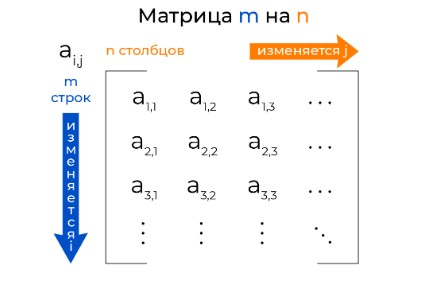
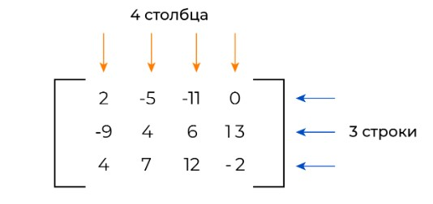
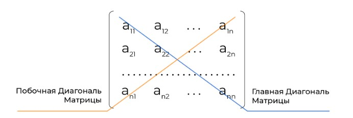
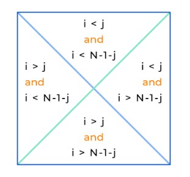

План изучения работы с матрицами в Python

1. Основы и представление матриц

- Матрица как список списков:
  - Определение двумерных списков.
  - Пример инициализации матрицы.
  - Доступ к элементам по индексам.
- Использование встроенных структур данных:
  - Плюсы и минусы списка списков для представления матрицы.
  - Ограничения стандартных списков.

2. Базовые операции над матрицами

- Итерация по строкам и столбцам:
  - Использование вложенных циклов для обхода матрицы.
  - Построчная и поколоночная обработка.
- Создание матриц определенного размера:
  - Генерация матрицы через списковые включения.
  - Заполнение значениями по умолчанию.
- Ввод и вывод матриц:
  - Чтение матрицы из файла или ввода пользователя.
  - Отображение матрицы в удобном виде.

3. Основные операции с матрицами

- Сложение и вычитание матриц.
- Умножение матриц (поэлементное и матричное).
- Транспонирование матрицы:
  - Алгоритм ручной транспозиции.
  - Использование списковых включений.
- Нахождение определителя и обратной матрицы:
- Теоретическая основа.
- Ограничения при реализации без библиотек.

4. Использование библиотеки NumPy

- Создание матриц:
  - Функции numpy.array() и numpy.zeros().
- Арифметические операции:
  - Простое сложение, умножение, транспонирование.
- Интеграция с линейной алгеброй:
  - Функции для вычисления определителя, ранга, обратной матрицы (numpy.linalg.det, numpy.linalg.inv).
- Улучшение производительности операций с большими матрицами.

5. Библиотека pandas (работа с таблицами как матрицами)

- Создание DataFrame:
  - Преобразование DataFrame в массив и обратно.
  - Обход строк и столбцов.
- Операции, подобные матричным:
  - Сложение, выборка строк/столбцов, фильтрация данных.

6. Генерация случайных матриц

- Использование стандартного модуля random:
  - Создание случайной матрицы.
- NumPy и SciPy для генерации матриц:
  - Матрицы с нормальным и равномерным распределением.

7. Алгоритмы на основе матриц

- Поиск минимального и максимального элементов.
- Подсчет суммы строк, столбцов и всей матрицы.
- Алгоритм умножения матриц (алгоритм Страссена).
- Решение систем линейных уравнений через матрицы.

8. Работа с матрицами для реальных задач

- Компьютерное зрение:
  - Преобразование изображений в матрицы (с использованием OpenCV).
- Рекомендательные системы:
  - Матрицы смежности и факторизация.
- Научные вычисления:
  - Использование SciPy для сложных операций.

9. Оптимизация и работа с большими матрицами

- Сжатие матриц:
  - Разреженные матрицы (SciPy Sparse).
- Параллельные вычисления:
  - Применение библиотек для обработки больших объемов данных (Dask, CuPy).

Итог:
Для работы с матрицами в Python нужно освоить:

- Основы работы с двумерными списками.
- Применение библиотек (NumPy, pandas).
- Алгоритмы обработки матриц.
- Использование матриц для решения прикладных задач.

## Матрицы

Матрицы - это прямоугольные таблицы, заполненные какими-то значениями, обычно числами.



Давайте заведем матрицу размера 3×4 ( 3 строки и 4 столбца), содержащую числа, и получим элемент на позиции (2, 3), то есть элемент второй строки в третьем столбце.

```py
matrix  = [[2, -5, -11, 0],
           [-9, 4, 6, 13],
           [4, 7, 12, -2]]

print(matrix[1][2])  # вывод элемента на позиции (2, 3)
```

В переменной matrix хранится вся матрица, при этом matrix[1] — список значений во второй строке, matrix[1][2] — элемент в третьем столбце этой строки.



## Перебор элементов матрицы

Чтобы перебрать элементы матрицы, необходимо использовать вложенные циклы. Например, выведем на экран все элементы матрицы, перебирая их по строкам:

```py
rows, cols = 3, 4  # rows - количество строк, cols - количество столбцов

matrix  = [[2, 3, 1, 0],
           [9, 4, 6, 8],
           [4, 7, 2, 7]]

for r in range(rows):
    for c in range(cols):
        print(matrix[r][c], end=' ')
    print()
```

Для перебора элементов матрицы по столбцам можно использовать следующий код:

```py
rows, cols = 3, 4  # rows - количество строк, cols - количество столбцов

matrix  = [[2, 3, 1, 0],
           [9, 4, 6, 8],
           [4, 7, 2, 7]]

for c in range(cols):
    for r in range(rows):
        print(matrix[r][c], end=' ')
    print()
```

## Квадратные матрицы

Матрица с одинаковым количеством строк и столбцов называется квадратной. У квадратной матрицы есть две диагонали:

- `главная`: **проходит из верхнего левого в правый нижний угол матрицы**;
- `побочная`: **проходит из нижнего левого в правый верхний угол матрицы**.



### Главная диагональ

- Элементы с равными индексами `i == j` находятся на главной диагонали. Такие элементы обозначаются `matrix[i][i]`.
- Индексы `i` и `j` элементов на **главной диагонали связаны соотношением** `i = j`.
- Если элемент находится **выше главной диагонали**, то `i < j`, если **ниже** - `i > j`.

### Побочная диагональ

- Элементы с индексами `i` и `j`, связанными соотношением `i + j + 1 = n` (или `j = n - i - 1`), где `n — размерность матрицы`, находятся на **побочной диагонали**.
- Индексы `i` и `j` элементов на побочной диагонали связаны соотношением `i + j + 1 = n` (или `j = n - i - 1`), где `n — размерность матрицы`.
- Если элемент находится **выше побочной диагонали**, то `i + j + 1 < n`, если **ниже** - `i + j + 1 > n`.



Таким образом, чтобы установить элементы главной или побочной диагонали, достаточно одного цикла:

```py
n = 8
matrix = [[0]*n for _ in range(n)]    # создаем квадратную матрицу размером 8×8

for i in range(n):                    # заполняем главную диагональ единицами, а побочную двойками
    matrix[i][i] = 1
    matrix[i][n-i-1] = 2

for r in range(n):                    # выводим матрицу
    for c in range(n):
        print(matrix[r][c], end=' ')
    print()
```

## Поменять местами строки со столбцами

```py
n = 3
a = [[1, 2, 3],
     [4, 5, 6],
     [7, 8, 9]]

for i in range(n):
    for j in range(n):
        print(a[j][i], end=' ')
    print()

# Вывод:
# 1 4 7
# 2 5 8
# 3 6 9
```

## Вывести матрицу в обратном порядке

```py
n = 3
a = [[1, 2, 3],
     [4, 5, 6],
     [7, 8, 9]]

for i in range(n):
    for j in range(n):
        print(a[n - i - 1][n - j - 1], end=' ')
    print()

# Вывод:
# 9 8 7
# 6 5 4
# 3 2 1
```

## След матрицы

Следом квадратной матрицы называется сумма элементов главной диагонали.

```py
matrix = [
  [1,2,3],
  [4,5,6],
  [7,8,9]
]

track = 0
for i in range(len(matrix)):
    track += matrix[i][i]
```

## Элементы **ниже** `главной диагонали` (включительно и не включительно)

```py
# Определяем матрицу 4x4
matrix = [
    [1, 2, 3, 4],
    [5, 6, 7, 8],
    [9, 10, 11, 12],
    [13, 14, 15, 16]
]

# Проходим по элементам ниже главной диагонали (включительно)
for i in range(len(matrix)):
    for j in range(i + 1):  # j <= i
        print(matrix[i][j], end=" ")
    print()

# Проходим по элементам ниже главной диагонали (не включительно)
for i in range(1, len(matrix)):  # начинаем с 1
    for j in range(i):  # j < i
        print(matrix[i][j], end=" ")
    print()
```

## Элементы **выше** `главной диагонали` (включительно и не включительно)

```py
# Определяем матрицу 4x4
matrix = [
    [1, 2, 3, 4],
    [5, 6, 7, 8],
    [9, 10, 11, 12],
    [13, 14, 15, 16]
]

# Проходим по элементам выше главной диагонали (включительно)
for i in range(len(matrix)):
    for j in range(i, len(matrix)):  # j >= i
        print(matrix[i][j], end=" ")
    print()

# Проходим по элементам выше главной диагонали (не включительно)
for i in range(len(matrix)):
    for j in range(i + 1, len(matrix)):  # j > i
        print(matrix[i][j])
```

## Элементы **ниже** `побочной диагонали` (включительно и не включительно)

```py
matrix = [
    [1, 2, 3, 4],
    [5, 6, 7, 8],
    [9, 10, 11, 12],
    [13, 14, 15, 16]
]

# Проходим по элементам ниже побочной диагонали (включительно)
n = len(matrix)
for i in range(n):
    for j in range(n - i):  # j <= n - i - 1
        print(matrix[i][j])

# Проходим по элементам ниже побочной диагонали (не включительно)
for i in range(n):
    for j in range(n - i - 1):  # j < n - i - 1
        print(matrix[i][j], end=" ")
    print()
```

## Элементы **выше** `побочной диагонали` (включительно и не включительно)

```py
matrix = [
    [1, 2, 3, 4],
    [5, 6, 7, 8],
    [9, 10, 11, 12],
    [13, 14, 15, 16]
]

# Проходим по элементам выше побочной диагонали (включительно)
n = len(matrix)
for i in range(n):
    for j in range(n - i - 1, n):  # j >= n - i - 1
        print(matrix[i][j], end=" ")
    print()

# Проходим по элементам выше побочной диагонали (не включительно)
for i in range(n):
    for j in range(n - i, n):  # j > n - i - 1
        print(matrix[i][j], end=" ")
    print()
```

## Проверка симметричности матрицы относительно главной диагонали
Матрица называется симметричной относительно главной диагонали, если для всех элементов выполняется условие: `a[i][j]=a[j][i]`.

```py
matrix = [[0, 1, 2], [1, 2, 3], [2, 3, 4]]

n = len(matrix)
for i in range(n):
    flag = None
    for j in range(n):
        if matrix[i][j] != matrix[j][i]:
            print("Не семетрична!")
            flag = True
            break
    if flag:
        break
else:
    print("Семетрична!")
```

## Проверка симметричности матрицы относительно побочной диагонали

Матрица называется симметричной относительно побочной диагонали, если для всех элементов выполняется условие: `a[i][j]=a[n−j−1][n−i−1]`, где `n — размерность матрицы`.

```py
matrix = [[0, 1, 2], [1, 2, 3], [2, 3, 4]]

n = len(matrix)
for i in range(n):
    flag = None
    for j in range(n):
        if matrix[i][j] != [n−j−1][n−i−1]:
            print("Не семетрична!")
            flag = True
            break
    if flag:
        break
else:
    print("Семетрична!")
```