# Числовые типы данных

**В Python есть три дополнительных числовых типа данных**:

- `Decimal` – **десятичное число, для выполнения точных расчетов**;
- `Fraction` – **число, представляющее собой обыкновенную дробь, с заданным числителем и знаменателем**;
- `Complex` – **комплексное число**.

## Decimal

### **Сравнение чисел `float`**

Сравним два кода:

```python
# Первый
if 0.3 == 0.3:
    print('YES')
else:
    print('NO')

# Вывод: YES


# Второй
num = 0.1 + 0.1 + 0.1

if num == 0.3:
    print('YES')
else:
    print('NO')

# Вывод: NO
```

Результатом выполнения второго кода будет `NO`, так как на самом деле в переменной `num` хранится что-то типа `0.30000000000000004`.

Из-за ограничений в **сохранении точного значения** чисел даже простейшие математические операции могут **выдавать ошибочный результат**. Поэтому, **чтобы сравнивать два `float` числа, мы должны использовать такой код**:

```python
num = 0.1 + 0.1 + 0.1
eps = 0.000000001           # точность сравнения

if abs(num - 0.3) < eps:    # число num отличается от числа 0.3 менее чем 0.000000001
    print('YES')
else:
    print('NO')
```

### **Тип данных `Decimal`**

**Тип данных `Decimal` – это класс из стандартного модуля `decimal`**. Он представляет собой **число с плавающей точкой**, как и `float`. **Однако `Decimal` имеет ряд существенных отличий от `float`**. Тип Decimal создан, чтобы операции над вещественными числами в компьютере выполнялись как в математике, и равенство `0.1 + 0.1 + 0.1 == 0.3` было верным.

Точность результатов арифметических действий очень важна для **научных вычислений**, **в сфере финансов** и **бизнеса**. **Для таких задач тип данных `float` не подходит**.

Тип данных `float` реализован по стандарту `IEEE-754` как число с плавающей точкой двойной точности (`64 бита`) с основанием экспоненты равным `2`. Так как `float` поддерживается аппаратно, **быстродействие при использовании этого типа данных сравнительно велико**.

**Тип данных `Decimal` – число с плавающей точкой с основанием экспоненты `10`**. Он реализован по стандарту `IBM: General Decimal Arithmetic Specification`, в свою очередь основанному на стандартах `IEEE`.

Тип данных `Decimal` реализован программно, поэтому он **в разы медленнее типа данных `float`**, реализованного аппаратно.

**Тип данных `Decimal` оперирует числами с произвольной – задаваемой программистом, но конечной точностью**. По умолчанию точность составляет 28 десятичных знаков.

**Тип данных `Decimal` – неизменяемый**. Операции над ним приводят к созданию новых объектов, при этом старые не меняются.

Так как `Decimal` **реализован программно** – его можно **на ходу настраивать как угодно программисту**. Для этого есть **контекст** – **объект, содержащий настройки для выполнения операций**. **Операции, выполняемые в контексте, следуют заданным в нем правилам**. Для **`float` все правила фиксированы на аппаратном уровне**.

Для типа данных `Decimal` можно **настроить**:

- **точность выполнения операций в количестве десятичных знаков**;
- **режимы округления**;
- **режимы обработки исключительных ситуаций** (деление на ноль, переполнение и так далее).

### **Создание `Decimal` чисел**

**Создать `Decimal` число можно из обычного целого числа (`int`), из числа с плавающей точкой (`float`) или из строки (`str`)**.

```python
from decimal import *

d1 = Decimal(1)
d2 = Decimal(567)
d3 = Decimal(-93)
d4 = Decimal('12345')
d5 = Decimal('52.198')

print(d1, d2, d3, d4, d5, sep='\n')

# Вывод:
# 1
# 567
# -93
# 12345
# 52.198
```

**При создании `Decimal` чисел из чисел с плавающей точкой (`float`) возникают проблемы.**

```python
from decimal import *

num = Decimal(0.1)

print(num)
# Вывод: 0.1000000000000000055511151231257827021181583404541015625
```

Не рекомендуется создавать `Decimal` числа из `float` чисел. В `Decimal` попадет уже неправильно округленное число. Создавать `Decimal` числа нужно из `целых чисел`, либо из `строк`!

### **Арифметические операции над `Decimal` числами**

С `Decimal` числами **работают все привычные операции**: `сложение`, `вычитание`, `умножение`, `деление`, `возведение в степень`.

```python
from decimal import *

num1 = Decimal('5.2')
num2 = Decimal('2.3')

print(num1 + num2)
print(num1 - num2)
print(num1 * num2)
print(num1 / num2)
print(num1 // num2)
print(num1 ** num2)

# Вывод
# 7.5
# 2.9
# 11.96
# 2.260869565217391304347826087
# 2
# 44.34122533787992500412791298
```

Можно совершать **арифметические операции над `Decimal` и целыми числами**, но **не рекомендуется смешивать их с `float`**.

```python
from decimal import *

num = Decimal('5.2')

print(num + 1)
print(num - 10)
print(num * 2)
print(num ** 4)

# Вывод:
# 6.2
# -4.8
# 10.4
# 731.1616
```

### **Математические функции**

Тип данных `Decimal` содержит некоторые **встроенные математические методы**, возвращающие значения `Decimal`.

- `sqrt()` вычисляет **квадратный корень** из `Decimal` числа.
- `exp()` возвращает **`e` в степени `x`** для `Decimal` числа.
- `ln()` вычисляет **натуральный логарифм** (по основанию e) `Decimal` числа.
- `log10()` вычисляет **десятичный логарифм** (по основанию 10) `Decimal` числа.

```python
from decimal import *

num = Decimal('10.0')

print(num.sqrt())
print(num.exp())
print(num.ln())
print(num.log10())

# Вывод:
# 3.162277660168379331998893544
# 22026.46579480671651695790065
# 2.302585092994045684017991455
# 1
```

Тип данных `Decimal` также содержит полезный метод `as_tuple()` который возвращает **кортеж из 3 элементов**:

- `sign` – **знак числа** (0 для положительного числа и 1 для отрицательного числа);
- `digits` – **цифры числа**;
- `exponent` – **значение экспоненты** (количество цифр после точки, умноженное на −1),

```python
from decimal import *

num1 = Decimal('-1.4568769017')
num2 = Decimal('0.523')

print(num1.as_tuple())
print(num2.as_tuple())

# Вывод:
# DecimalTuple(sign=1, digits=(1, 4, 5, 6, 8, 7, 6, 9, 0, 1, 7), exponent=-10)
# DecimalTuple(sign=0, digits=(5, 2, 3), exponent=-3)
```

```python
from decimal import *

num = Decimal('-1.4568769017')
num_tuple = num.as_tuple()

print(num_tuple.sign)
print(num_tuple.digits)
print(num_tuple.exponent)
# Вывод:
# 1
# (1, 4, 5, 6, 8, 7, 6, 9, 0, 1, 7)
# -10
```

### **Работа с контекстом `Decimal` чисел**

**Базовые параметры `Decimal` можно посмотреть в его контексте, выполнив функцию `getcontext()`**.

```python
from decimal import *

print(getcontext())
# Вывод:
# Context(prec=28, rounding=ROUND_HALF_EVEN, Emin=-999999, Emax=999999, capitals=1, clamp=0, flags=[], traps=[InvalidOperation, DivisionByZero, Overflow])
```

### **Точность чисел**

**Контекстом в `Decimal` можно управлять, устанавливая свои значения**. Например, чтобы управлять точностью `Decimal`, необходимо **изменить параметр контекста `prec`** (от англ. precision – точность). При этом **точность вступает в силу только во время арифметических операций, а не при создании самих чисел**.

```python
from decimal import *

getcontext().prec = 3      # устанавливаем точность в 3 знака

num = Decimal('3.1415')

print(num)
print(num * 1)
print(num * 2)
print(num / 2)
# Вывод:
# 3.1415
# 3.14
# 6.28
# 1.57
```

### **Округление чисел**

**Округляют числа `Decimal` с помощью метода `quantize()`**. Этот метод **в качестве первого аргумента принимает объект `Decimal`, указывающий на формат округления**.

```python
from decimal import *

getcontext().prec = 4                    # устанавливаем точность числа

num = Decimal('3.1415926535')

print(num.quantize(Decimal('1.000')))    #  округление до 3 цифр в дробной части
print(num.quantize(Decimal('1.00')))     #  округление до 2 цифр в дробной части
print(num.quantize(Decimal('1.0')))      #  округление до 1 цифр в дробной части

# Вывод:
# 3.142
# 3.14
# 3.1
```

Если **точность округления установлена в 2**, а **формат округления Decimal('1.00')**, то **возникнет ошибка**. Чтобы избежать ее, необходимо **поменять точность округления на 3 и больше**.

```python
from decimal import *

getcontext().prec = 2                    # устанавливаем точность округления

num = Decimal('3.1415926535')

print(num.quantize(Decimal('1.00')))     #  округление до 2 цифр в дробной части

# Ошибка: decimal.InvalidOperation: [<class 'decimal.InvalidOperation'>]
```

Помимо первого параметра, **метод `quantize()` принимает в качестве второго параметра стратегию округления**:

- `ROUND_CEILING` – **округление в направлении бесконечности** (Infinity);
- `ROUND_FLOOR` – **округляет в направлении минус бесконечности** (- Infinity);
- `ROUND_DOWN` – **округление в направлении нуля**;
- `ROUND_HALF_EVEN` – **округление до ближайшего четного числа, число `6.5` округлится не до `7`, а до `6`**;
- `ROUND_HALF_DOWN` – **округление до ближайшего нуля**;
- `ROUND_UP` – **округление от нуля**;
- `ROUND_05UP` – **округление от нуля** (если последняя цифра после округления до нуля была бы `0` или `5`, в противном случае – `к нулю`).

```python
from decimal import *

num = Decimal('3.456')

print(num.quantize(Decimal('1.00'), ROUND_CEILING))
print(num.quantize(Decimal('1.00'), ROUND_FLOOR))

# Вывод:
# 3.46
# 3.45
```

### Задачи

1. Decimal числа, разделенные символом пробела, хранятся в строковой переменной s. Дополните приведенный код так, чтобы он вывел сумму наибольшего и наименьшего Decimal числа. s = '0.77 4.03 9.06 3.80 7.08 5.88 0.23 4.65 2.79 0.90 4.23 2.15 3.24 8.57 0.10 8.57 1.49'.
2. Decimal числа, разделенные символом пробела, хранятся в строковой переменной s. Дополните приведенный код так, чтобы он вывел на первой строке сумму всех чисел, а на второй строке 5 самых больших чисел в порядке убывания, разделенных символом пробела. s = '0.77 4.03 9.06 3.80 7.08 5.88 0.23 4.65 2.79 0.90 4.23 2.15 3.24 8.57 0.10 8.57 1.49'.
3. Дополните приведенный код так, чтобы он вывел сумму наибольшей и наименьшей цифры Decimal числа.

```python
from decimal import *
num = Decimal(input())
```

## fractions

### **Рациональное число**

**Рациональное число** – это число, которое можно представить в виде дроби `m/n`, где `m,n` соответственно, `числитель` и `знаменатель`, которые имеют **целочисленное значение**, при этом **знаменатель не равен нулю**.

### **Тип данных `Fraction`**

Для работы с рациональными числами в Python используется тип данных Fraction. Тип данных Fraction как и Decimal реализован программно, поэтому он в разы медленнее встроенных числовых типов данных int и float. Тип данных Fraction неизменяемый. Операции над данными этого типа приводят к созданию новых объектов, при этом старые не меняются.

### **Создание `Fraction`**

Чтобы использовать возможности типа данных Fraction, нужно предварительно подключить модуль fractions:

```py
from fractions import Fraction
```

Создать Fraction число можно несколькими способами:

- из целых чисел, передав значения числителя и знаменателя дроби,
- из строки на основании десятичного представления;
- из строки на основании обыкновенной дроби;
- из числа с плавающей точкой (не рекомендуется).

```py
from fractions import Fraction

num1 = Fraction(3, 4)     # 3 - числитель, 4 - знаменатель
num2 = Fraction('0.55')
num3 = Fraction('1/9')

print(num1, num2, num3, sep='\n')
# Вывод:
# 3/4
# 11/20
# 1/9
```

Обратите внимание на то, что при создании рационального числа Fraction, автоматически происходит сокращение числителя и знаменателя дроби.

```py
from fractions import Fraction

num1 = Fraction(5, 10)
num2 = Fraction('75/100')
num3 = Fraction('0.25')

print(num1, num2, num3, sep='\n')
# Вывод:
# 1/2
# 3/4
# 1/4
```

### **Сравнение `Fraction` чисел**

Fraction числа можно сравнивать между собой точно так же, как и любые другие числа. Доступны 6 основных операторов сравнения:

- `>`: больше;
- `<`: меньше;
- `>=`: больше либо равно;
- `<=`: меньше либо равно;
- `==`: в точности равно;
- `!=`: не равно.

```py
from fractions import Fraction

num1 = Fraction(1, 2)        # 1/2
num2 = Fraction(15, 30)      # 15/30=1/2
num3 = Fraction(3, 5)        # 3/5
num4 = Fraction(5, 3)        # 5/3
num5 = 1
num6 = 0.8


print(num1 == num2)
print(num1 != num4)
print(num2 > num3)
print(num4 <= num1)
print(num1 < num5)
print(num6 > num4)

# Вывод:
# True
# True
# False
# False
# True
# False
```

### **Арифметические операции над `Fraction` числами**

Тип данных Fraction отлично интегрирован в язык Python. С Fraction числами работают все привычные операции: сложение, вычитание, умножение, деление, возведение в степень.

```py
from fractions import Fraction

num1 = Fraction('1/10')
num2 = Fraction('2/3')

print(num1 + num2)
print(num1 - num2)
print(num1 * num2)
print(num1 / num2)

# Вывод:
# 23/30
# -17/30
# 1/15
# 3/20
```

Мы также можем совершать арифметические операции над Fraction и целыми числами (миксовать Fraction и int), но не рекомендуется смешивать их с float.

### **Математические функции**

Fraction числа можно передавать как аргументы функций, ожидающих float. Тогда они будут преобразованы во float. К примеру, модуль math, оперирующий float числами, может работать и с Fraction числами.

Важно понимать, что результатом работы функций модуля math являются float числа, а не Fraction.

```py
from fractions import Fraction
from math import *

num1 = Fraction('1.44')
num2 = Fraction('0.523')

print(sqrt(num1))
print(sin(num2))
print(log(num1 + num2))

# Вывод:
# 1.2
# 0.4994813555186418
# 0.6744739152943241
```

### **Свойства `numerator` и `denominator`**

Для получения числителя и знаменателя Fraction числа используются свойства numerator и denominator.

```py
from fractions import Fraction

num = Fraction('5/16')

print('Числитель дроби равен:', num.numerator)
print('Знаменатель дроби равен:', num.denominator)

# Вывод:
# Числитель дроби равен: 5
# Знаменатель дроби равен: 16
```

Метод as_integer_ratio() возвращает кортеж, состоящий из числителя и знаменателя данного Fraction числа.

```py
from fractions import Fraction

num = Fraction('-5/16')

print(num.as_integer_ratio())

# Вывод: (-5, 16)
```

### **Метод `limit_denominator()`**

Метод limit_denominator() возвращает самую близкую к данному числу рациональную дробь, чей знаменатель не превосходит переданного аргумента.

```py
from fractions import Fraction
import math

print('PI =', math.pi)

num = Fraction(str(math.pi))

print('No limit =', num)

for d in [1, 5,  50, 90, 100, 500, 1000000]:
    limited = num.limit_denominator(d)
    print(limited)

# Вывод:
# PI = 3.141592653589793
# No limit = 3141592653589793/1000000000000000
# 3
# 16/5
# 22/7
# 267/85
# 311/99
# 355/113
# 3126535/995207
```

### **Стоит запомнить**

В Python нельзя совершать арифметические операции (+, -, *, /) между типами Decimal и Fraction.


## complex

### **Вещественные числа**

**Объединение рациональных и иррациональных чисел образует множество вещественных чисел**. **Геометрическая интерпретация множества вещественных чисел – это числовая прямая**:

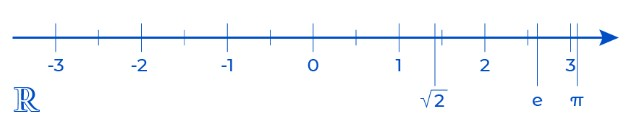

Каждому вещественному числу соответствует определённая точка числовой прямой, и наоборот – каждой точке числовой прямой обязательно соответствует некоторое вещественное число. Другими словами, числовая прямая полностью покрыта вещественными числами.

### **Мнимые числа**

Рассмотрим квадрат произвольного вещественного числа:
- `2 ⋅ 2 = 4`
- `(−2) ⋅ (−2) = 4`
- `0 ⋅ 0 = 0`
- `0.1 ⋅ 0.1 = 0.01`

Результат всегда **неотрицательное число**. Действительно, пусть a – произвольное вещественное число. Тогда `(a ⋅ a = a в степени 2) ≥ 0`. Таким образом, на множестве вещественных чисел, перемножая два одинаковых числа **мы всегда получаем неотрицательное число (большее, либо равное нулю)**.

Представим, что **существует число `i` (не являющееся вещественным), такое, что `i ⋅ i = i в степени 2 = −1`**. Будет ли такое обозначение полезным? **Оказывается, да!**

Такие числа в математике называются мнимыми и обозначают их буквой i, от слова imaginary (мнимый, воображаемый). Итак, получаем:

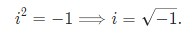

С таким числом (обозначением), можно решать задачи, где требуется извлечь квадратный корень из отрицательного числа.

Рассмотрим несколько примеров.
#### Пример 1
Выразите число `Корень квадратный из 9` через `i`.
Согласно введенному обозначению можем записать:

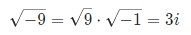

**Или в общем виде для любого положительного числа `x` существует равенство**:

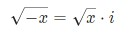

### **Мнимая единица**

Число `i = квадратный корень из -1` называется **мнимой единицей**. Введение мнимой единицы позволяет **расширить множество вещественных чисел до множества комплексных чисел**.

Мнимая единица i обладает интересным свойством: каждый раз при умножении на i она "циклически" проходит через 4 различных значения:

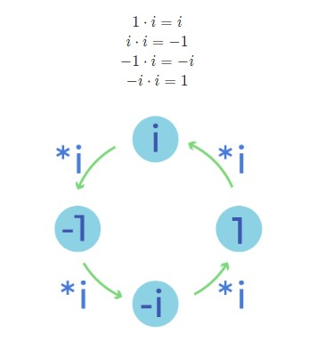

Получаем равенства натуральных степеней мнимой единицы:

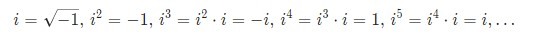

Несложно посчитать значения для больших показателей:

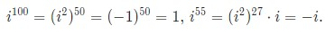

### **Комплексные числа в математике**

Комплексное число – комбинация вещественного и мнимого числа. Таким образом, число вида a+bi, где a,b – вещественные числа, называется комплексным числом. Число a – называется вещественной (действительной) частью комплексного числа, а число b – мнимой частью числа.

Заметим, что **действительная** (число a) и **мнимая** (число b) часть комплексного числа `a + bi` может быть **равна нулю**:

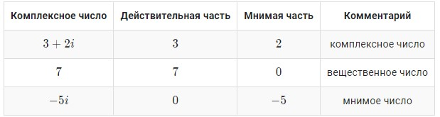

Комплексным числам нет места на числовой прямой, для них нужна так называемая **комплексная плоскость**. Для **графической интерпретации комплексных чисел нам потребуется две взаимно перпендикулярные прямые**.

**Горизонтальная прямая** (ось) отвечает за **действительную часть комплексного числа**, **вертикальная – за мнимую**.

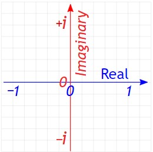

Любое комплексное число может быть представлено в виде точки на комплексной плоскости. Например, комплексное число 3+4i выглядит так:

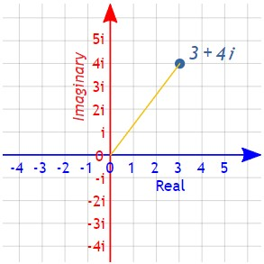


### Обозначения комплексных чисел

Комплексные числа обычно обозначаются буквой z=a+bi. Действительная часть комплексного числа обозначается как Re(z)= a, мнимая часть обозначается Im(z)=b.


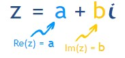

На комплексной плоскости комплексное число z=a+bi выглядит так:

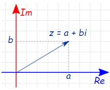

### Модуль комплексного числа

Модулем комплексного числа z=a+bi называется вещественное число, равное: 

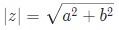

Такое число, равно расстоянию от точки (a;b) до начала координат, то есть до точки (0;0).

### **Сложение комплексных чисел**

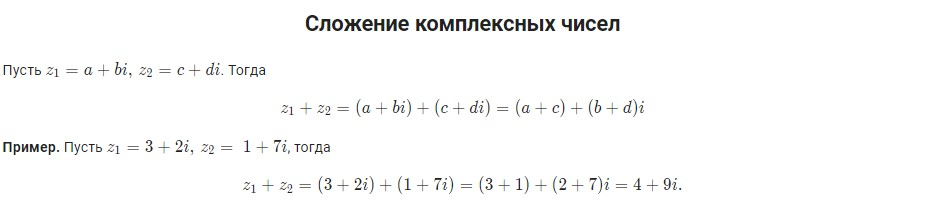

### **Разность комплексных чисел**

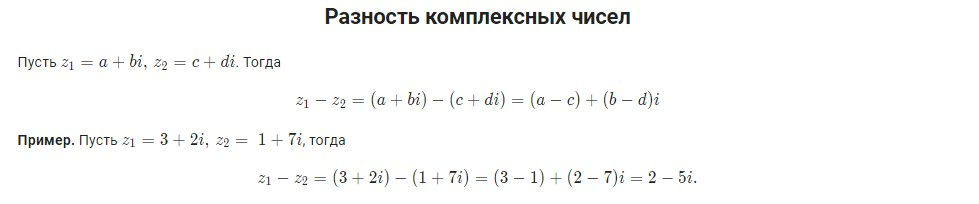

### **Умножение комплексных чисел**

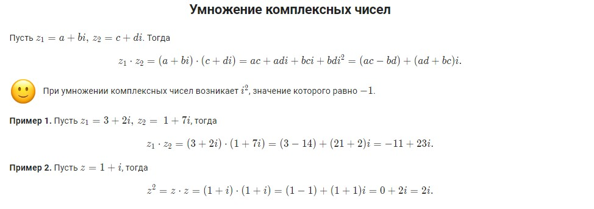

### **Сопряженные комплексные числа**

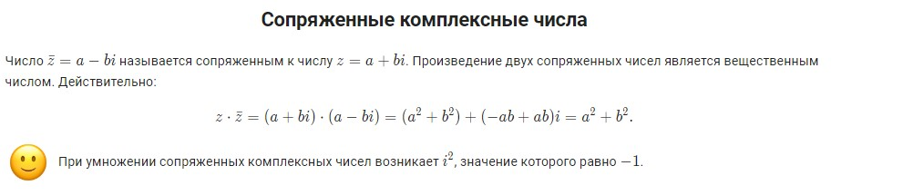

### **Деление комплексных чисел**

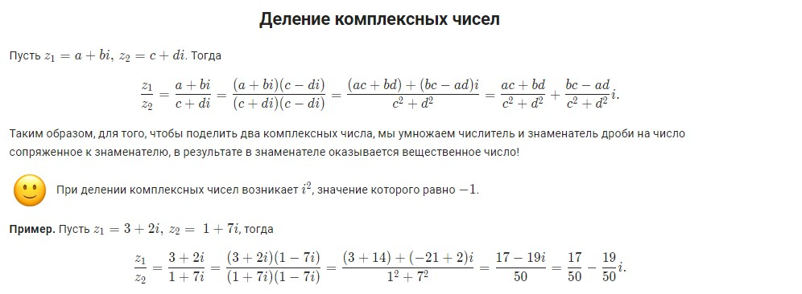

### **Комплексные числа в Python**

В языке Python есть возможность работать с комплексными числами. Общая форма представления комплексного числа следующая: real + imag j, где

- `real` – **вещественная часть комплексного числа**;
- `imag` – **мнимая часть комплексного числа, которая завершается символом j или J**.

```py
z1 = 5 + 7j
z2 = 1j
z3 = -3 + 5J
z4 = 1.5 + 3.2j

print(z1, z2, z3, z4, sep='\n')
print(type(z1))
# Вывод:
# (5+7j)
# 1j
# (-3+5j)
# (1.5+3.2j)
# <class 'complex'>
```

### **Создание комплексных чисел**

Комплексные числа можно создать с помощью литерала, как выше, а можно с помощью функции complex(), которая принимает два аргумента: вещественную и мнимую часть числа, либо строковое представление числа.

```py
z1 = -3 + 2j              # создание на основе литерала
z2 = complex(6, -8)       # z2 = 6 - 8j
z3 = complex(0, 2.5)      # z3 = 2.5j
z4 = complex(5, 0)        # z4 = 5 + 0j
z5 = complex('3+4j')      # создание на основе строки

print(z1, z2, z3, z4, z5, sep='\n')
# Вывод:
# (-3+2j)
# (6-8j)
# 2.5j
# (5+0j)
# (3+4j)
```

### **Арифметические операции над комплексными числами**

Тип данных complex отлично интегрирован в язык Python. С complex числами работают все привычные операции: сложение, вычитание, умножение, деление, возведение в степень.

```py
z1 = 1 + 3j
z2 = -3 + 2j

print('z1 + z2 =', z1 + z2)
print('z1 - z2 =', z1 - z2)
print('z1 * z2 =', z1 * z2)
print('z1 / z2 =', z1 / z2)
print('z1^20 =', z1**20)
# Вывол:
# z1 + z2 = (-2+5j)
# z1 - z2 = (4+1j)
# z1 * z2 = (-9-7j)
# z1 / z2 = (0.23076923076923078-0.8461538461538461j)
# z1^20 = (9884965888-1512431616j)
```

Мы также можем совершать арифметические операции над complex и целыми числами (миксовать complex, int, float).

```py
z = 1 + 3j

print(z + 5)
print(z - 2)
print(3*z)
print(z/2)
# Вывод:
# (6+3j)
# (-1+3j)
# (3+9j)
# (0.5+1.5j)
```

### **Методы и свойства комплексных чисел**

Для получения действительной и мнимой частей комплексного числа используются свойства real и imag.

```py
z = 3+4j

print('Действительная часть =', z.real)
print('Мнимая часть =', z.imag)
# Вывод:
# Действительная часть = 3.0
# Мнимая часть = 4.0
```

Для нахождения сопряженного комплексного числа можно использовать метод conjugate().

```py
z = 3+4j

print('Сопряженное число =', z.conjugate())

# Вывод: Сопряженное число = (3-4j)
```

### Для нахождения модуля комплексного числа используется встроенная функция `abs()`.
```py
z = 3+4j

print('Модуль числа =', abs(z))
# Вывод: Модуль числа = 5.0
```