# set (МНОЖЕСТВО)

**Множество** (`set`) — это **неупорядоченная коллекция уникальных элементов**.  
Множества используются для хранения множества элементов, где каждый элемент может присутствовать только один раз.

Они **поддерживают математические операции**, такие как **объединение**, **пересечение**, **разность** и **симметрическая разность**.

**Множества не поддерживают индексацию**, так как они неупорядочены.

## Множества в математике

**В математике множество** – **совокупность объектов, понимаемых как единое целое**.

При этом предполагается, что **объекты данной совокупности можно отличать друг от друга и от объектов, не входящих в эту совокупность**. Например, можно говорить:

- о множестве всех студентов данного курса;
- множестве всех языков программирования;
- множестве всех натуральных чисел;
- множестве всех точек данного отрезка.

### Обозначения

- **множества** обозначают большими латинскими буквами: `X`, `Y`
- **элементы множеств** – латинскими строчными буквами: `x`, `y`

Запись: `x ∈ X` ( `x ∉ X` ) означает, что `x` **является** (**не является**) элементом множества `X`.

### Конечные и бесконечные множества

- `A = {a,b,c,…,z}` – **множество букв английского алфавита является конечным множеством**;
- `B = {Тимур,Руслан,Роман,Оля}` – **множество имен авторов данного курса является конечным множеством**;
- `N = {1,2,3,4,5,…}` – **множество натуральных чисел является бесконечным множеством**.

### Равенство множеств

Если **два множества** `X` и `Y` **состоят из одних и тех же элементов**, то они **называются равными** `X = Y`.

`X = {a,b,c,d}` и `Y = {b,d,c,a}`, то `X = Y`.

### **Подмножество** и **надмножество**

**Если все элементы множества `X` принадлежат также и множеству `Y`, то говорят, что `X` является подмножеством `Y`, а записывается это так: `X ⊂ Y`**.

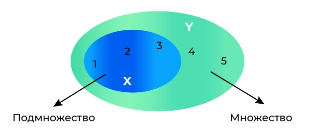

Е**сли множество `X` является подмножеством множества `Y`, то также говорят, что множество `Y` является надмножеством множества `X`, а записывается это так: `Y ⊃ X`**.

**Любое множество также является подмножеством самого себя**. Про такое подмножество говорят **нестрогое подмножество**:

- множество `{1,2,3}` является **нестрогим подмножеством множества** `{1,2,3}`;
- множество `{1,2,3}` является **строгим подмножеством множества** `{1,2,3,4}`.

### Пустое множество

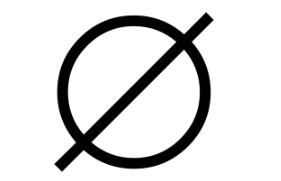

### Примечание

- **Множества** – **неупорядоченные совокупности, то есть, неважно, в каком порядке указаны элементы множества**.
- **Если множество X конечно, то через ∣X∣ обозначается количество элементов множества X**.
- **Если множество X содержит n элементов, то оно имеет `2^n подмножеств`, включая пустое множество**. Например, множество `X = {a,b,c}` **содержит 3 элемента и имеет 8 подмножеств**:
  - `{∅}`;
  - `{a}`;
  - `{b}`;
  - `{c}`;
  - `{a,b}`;
  - `{a,c}`;
  - `{b,c}`;
  - `{a,b,c}`.

## Числовые множества

- множество **натуральных чисел**;
- множество **целых чисел**;
- множество **рациональных чисел**;
- множество **вещественных чисел**;
- множество **комплексных чисел**.

### Натуральные числа `N`

**Множество натуральных чисел обозначается буквой `N` и содержит следующие числа: `N={1,2,3,4,5,…}`. Число ноль не является натуральным числом**.

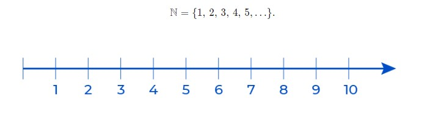

### Целые числа `Z`

**Множество целых чисел обозначается буквой Z и содержит следующие числа: `Z={0,±1,±2,±3,±4,±5,…}`**.

**Множество натуральных чисел является подмножеством множества целых чисел, поскольку каждый элемент множества `N` принадлежит множеству `Z`**.

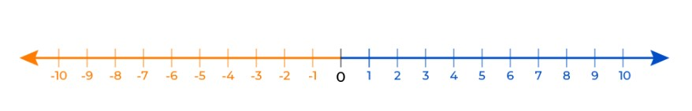

### Рациональные числа `Q`

**Рациональным числом в математике называется любое число, представимое в виде частного двух целых чисел с отличным от нуля знаменателем. Множество рациональных чисел обозначается буквой `Q` и содержит следующие числа: `Q = {m/n, m ∈ Z, n ∈ N}`**.

**Множество целых чисел является подмножеством множества рациональных чисел, так как любое целое число можно представить в виде дроби со знаменателем, равным 1.**

Любое рациональное число это либо конечная, либо бесконечная периодическая десятичная дробь. К примеру:

- `1/2 = 0.5` - конечная непериодическая дробь;
- `3/8 = 0.375` - конечная непериодическая дробь;
- `1/3 = 0.(3)` - бесконечная периодическая десятичная дробь;
- `7/11 = 0.(63)` - бесконечная периодическая десятичная дробь.

### Иррациональные числа `I`

Н**е все числа в математике можно представить в виде рационального числа. Примером служат числа**:

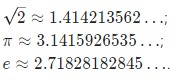

**Такие числа называются иррациональными и являются бесконечными непериодическими дробями**. Иными словами, в «бесконечных хвостах» иррациональных чисел нет никакой закономерности. Иррациональные числа часто обозначают буквой I.

### Вещественные числа `R`

**Объединение рациональных и иррациональных чисел образует множество вещественных чисел. Множество вещественных чисел `R` определяется так: `R = Q ∪ I`**.

- `∪` – означает **объединение множеств**.

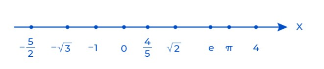

Множество **вещественных чисел** также называют множеством **действительных чисел**.

### Множество комплексных чисел `C`

**Комплексным числом в математике называется любое число, представимое в виде `a+bi`, где a и b – вещественные числа, а `i = корень из −1` – мнимая единица. Множество комплексных чисел обозначается буквой `C`**.

**Множество вещественных чисел является подмножеством множества комплексных чисел, так как любое вещественное число можно представить в виде `a + bi`, где `b = 0`**.

### Графическая иллюстрация числовых множеств

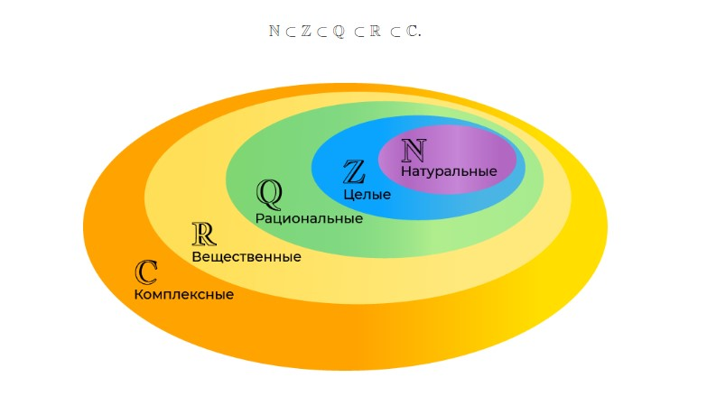

### Числовые множества при решении уравнений

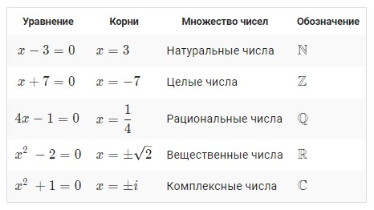

## Операции над множествами

Операции над множествами выполняются для получения новых множеств из уже существующих.

Основные операции над множествами:

- **объединение**;
- **пересечение**;
- **разность**;
- **симметрическая разность** ;
- **дополнение**.

### Диаграммы Эйлера-Венна

**Диаграммы Эйлера-Венна** – геометрическое представление множеств. Большой прямоугольник представляет универсальное множество U, а круги в нем – отдельные множества. Круги пересекаются в соответствии с условиями задачи. Точки внутри областей диаграммы — элементы соответствующих множеств. На диаграмме можно заштриховать образованные при пересечении кругов множества.

### Объединение множеств `∪`

**Объединение множеств** – множество, состоящее из элементов, принадлежащих хотя бы одному из объединяемых множеств. Для объединения множеств используется символ `∪`. Например, если `X = {1,2,3,4,5}`, `Y = {3,4,7,8,9}`, то `X ∪ Y = {1,2,3,4,5,7,8,9}`.

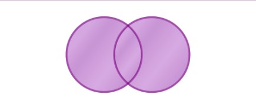

### Пересечение множеств `∩`

**Пересечение множеств** – множество, состоящее из элементов, принадлежащих одновременно каждому из пересекающихся множеств. Для пересечения множеств используется символ `∩`. Например, если `X = {1,2,3,4,5}`, `Y = {3,4,7,8,9}`, то `X ∩ Y = {3,4}`.

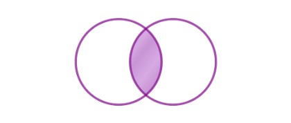

### Разность множеств `∖`

**Разность множеств** – множество, в которое входят только элементы первого множества, не входящие во второе множество. Для разности множеств используется символ `∖`. Например, если `X = {1,2,3,4,5}`, `Y = {3,4,7,8,9}`, то `X ∖ Y = {1,2,5}`.

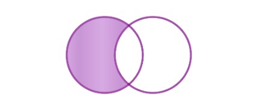

### Симметрическая разность `△`

**Симметрическая разность множеств** – множество, включающее все элементы исходных множеств, не принадлежащие одновременно обоим исходным множествам. Другими словами, симметрическая разность это множество `(X ∪ Y) ∖ (X ∩ Y)`. Для симметрической разности множеств пользуется символ `△`. Например, если `X = {1,2,3,4,5}`, `Y = {3,4,7,8,9}`, то `X △ Y = {1,2,5,7,8,9}`.

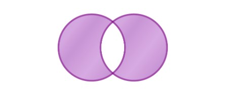

### Дополнение `¬`

**Дополнение множества** – множество всех элементов, в нем не содержащихся. Для операции дополнения множества используется символ `¬`.


## Особенности объектов множества в Python.

В множества можно записывать **любые неизменяемые (`immutable`) типы данных**, такие как **числа**, **строки**, **кортежи**.

## Способы создания множества

### **Создание пустого множества**:

```python
my_set = set()
print(my_set)
```

### **Использование литерала множества**:

```python
my_set = {1, 2, 3, 4}
print(my_set)
```

### **Использование функции `set()`**:

```python
my_set = set([1, 2, 3, 4])
print(my_set)
```

### Создание множества из нескольких итерируемых объектов

```python
# Создание множества из строки
set_from_string = set("hello")
print(set_from_string)  # Output: {'h', 'e', 'l', 'o'}

# Создание множества из списка
set_from_list = set([1, 2, 3, 4, 4, 5])
print(set_from_list)  # Output: {1, 2, 3, 4, 5}

# Создание множества из кортежа
set_from_tuple = set((1, 2, 3, 4, 4, 5))
print(set_from_tuple)  # Output: {1, 2, 3, 4, 5}
```

## Методы множества

### 1. Методы для изменения и копирования множества:

#### `add()` — **добавляет элемент в множество**.

```python
my_set = {1, 2, 3}
my_set.add(4)
print(my_set)  # Output: {1, 2, 3, 4}
```

#### `remove()` — **удаляет элемент из множества, вызывает ошибку, если элемент не найден**.

```python
my_set = {1, 2, 3}
my_set.remove(2)
print(my_set)  # Output: {1, 3}
```

#### `discard()` — **удаляет элемент из множества, не вызывает ошибку, если элемент не найден**.

```python
my_set = {1, 2, 3}
my_set.discard(2)
print(my_set)  # Output: {1, 3}
```

#### `pop()` — **удаляет и возвращает случайный элемент из множества**.

```python
my_set = {1, 2, 3}
element = my_set.pop()
print(element)  # Output: 1 (или 2, или 3)
print(my_set)  # Output: {2, 3} (или {1, 3}, или {1, 2})
```

#### `clear()` — **удаляет все элементы из множества**.

```python
my_set = {1, 2, 3}
my_set.clear()
print(my_set)  # Output: set()
```

#### `copy()` — **возвращает копию множества**.

```python
set1 = {1, 2, 3}
set_copy = set1.copy()
print(set_copy)  # Output: {1, 2, 3}
```

### 2. Методы для математических операций с множествами:

#### `union()` — **возвращает объединение множеств**.

```python
set1 = {1, 2, 3}
set2 = {3, 4, 5}
union_set = set1.union(set2)
print(union_set)  # Output: {1, 2, 3, 4, 5}
```

#### `intersection()` — **возвращает пересечение множеств**.

```python
set1 = {1, 2, 3}
set2 = {2, 3, 4}
intersection_set = set1.intersection(set2)
print(intersection_set)  # Output: {2, 3}
```

#### `difference()` — **возвращает разность множеств**.

```python
set1 = {1, 2, 3}
set2 = {2, 3, 4}
difference_set = set1.difference(set2)
print(difference_set)  # Output: {1}
```

#### `symmetric_difference()` — **возвращает симметрическую разность множеств**.

```python
set1 = {1, 2, 3}
set2 = {2, 3, 4}
sym_diff_set = set1.symmetric_difference(set2)
print(sym_diff_set)  # Output: {1, 4}
```

### 3. Методы множеств, изменяющие текущие множества

#### `update()` - **изменяет исходное множество по объединению**.

```python
myset1 = {1, 2, 3, 4, 5}
myset2 = {3, 4, 6, 7, 8}

myset1.update(myset2)  # изменяем множество myset1
print(myset1) # {1, 2, 3, 4, 5, 6, 7, 8}

# Аналогичный результат получается, если использовать оператор |=:
myset1 = {1, 2, 3, 4, 5}
myset2 = {3, 4, 6, 7, 8}

myset1 |= myset2
print(myset1) # {1, 2, 3, 4, 5, 6, 7, 8}
```

#### `intersection_update()` - **изменяет исходное множество по пересечению**.

```python
myset1 = {1, 2, 3, 4, 5}
myset2 = {3, 4, 6, 7, 8}

myset1.intersection_update(myset2)  # изменяем множество myset1
print(myset1) # {3, 4}

# Аналогичный результат получается, если использовать оператор &=:
myset1 = {1, 2, 3, 4, 5}
myset2 = {3, 4, 6, 7, 8}

myset1 &= myset2
print(myset1) # {3, 4}
```

#### `difference_update()` - **изменяет исходное множество по разности**.

```python
myset1 = {1, 2, 3, 4, 5}
myset2 = {3, 4, 6, 7, 8}

myset1.difference_update(myset2)  # изменяем множество myset1
print(myset1) # {1, 2, 5}

# Аналогичный результат получается, если использовать оператор -=:
myset1 = {1, 2, 3, 4, 5}
myset2 = {3, 4, 6, 7, 8}

myset1 -= myset2
print(myset1) # {1, 2, 5}
```

#### `symmetric_difference_update()` - **изменяет исходное множество по симметрической разности**.

```python
myset1 = {1, 2, 3, 4, 5}
myset2 = {3, 4, 6, 7, 8}

myset1.symmetric_difference_update(myset2)  # изменяем множество myset1
print(myset1) # {1, 2, 5, 6, 7, 8}

# Аналогичный результат получается, если использовать оператор ^=:
myset1 = {1, 2, 3, 4, 5}
myset2 = {3, 4, 6, 7, 8}

myset1 ^= myset2
print(myset1) # {1, 2, 5, 6, 7, 8}
```

Все основные операции над множествами выполняются двумя способами: при помощи метода или соответствующего ему оператора. Различие заключается в том, что метод может принимать в качестве аргумента не только множество (тип данных set), но и любой итерируемый объект (список, строку, кортеж..).

### 4. Методы для проверки отношений между множествами:

#### `issubset()` — **проверяет, является ли множество подмножеством другого множества**.

```python
set1 = {1, 2}
set2 = {1, 2, 3}
print(set1.issubset(set2))  # Output: True
```

#### `issuperset()` — **проверяет, является ли множество надмножеством другого множества**.

```python
set1 = {1, 2, 3}
set2 = {1, 2}
print(set1.issuperset(set2))  # Output: True
```

#### `isdisjoint()` - **определяет отсутствие общих элементов в множествах**.

```python
set1 = {1, 2, 3, 4, 5}
set2 = {5, 6, 7}
set3 = {7, 8, 9}

print(set1.isdisjoint(set2)) # False
print(set1.isdisjoint(set3)) # True
print(set2.isdisjoint(set3)) # False
```

### 4. Таблицы соответствия методов и операторов над множествами.

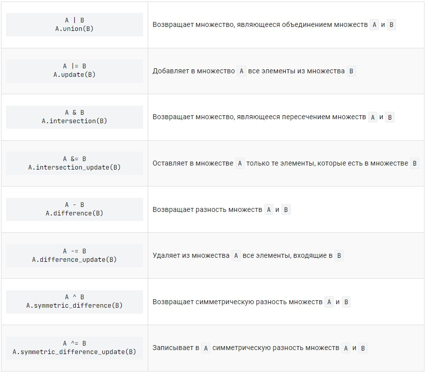

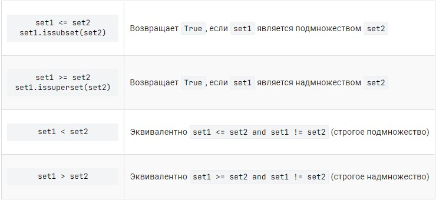

### 5. Frozenset

**Замороженное множество (frozenset) также является встроенной коллекцией в Python. Обладая характеристиками обычного множества, замороженное множество не может быть изменено после создания.**

#### Создание замороженного множества

```python
myset1 = frozenset({1, 2, 3})                         # на основе множества
myset2 = frozenset([1, 1, 2, 3, 4, 4, 4, 5, 6, 6])    # на основе списка
myset3 = frozenset('aabcccddee')                      # на основе строки

print(myset1) # frozenset({1, 2, 3})
print(myset2) # frozenset({1, 2, 3, 4, 5, 6})
print(myset3) # frozenset({'e', 'd', 'c', 'b', 'a'})
```

#### Операции над замороженными множествами

**Над замороженными множествами можно производить все операции, которые можно производить над обычными множествами**:

- **объединение множеств**: метод `union()` или оператор `|`;
- **пересечение множеств**: метод `intersection()` или оператор `&`;
- **разность множеств**: метод `difference()` или оператор `-`;
- **симметрическая разность множеств**: метод `symmetric_difference()` или оператор `^`.

**Результатом** операций над замороженными множествами будут **тоже замороженные множества**.

```python
myset1 = frozenset('hello')
myset2 = frozenset('world')

print(myset1 | myset2) # frozenset({'l', 'w', 'e', 'h', 'r', 'd', 'o'})
print(myset1 & myset2) # frozenset({'l', 'o'})
print(myset1 ^ myset2) # frozenset({'d', 'h', 'w', 'e', 'r'})
```

#### Дополнительная информация

- **Будучи изменяемыми, обычные множества не могут быть элементами других множеств. Замороженные множества являются неизменяемыми, а значит могут быть элементами других множеств**.

  ```python
  sentence = 'The cat in the hat had two sidekicks, thing one and thing two.'

  words = sentence.lower().replace('.', '').replace(',', '').split()

  vowels = ['a', 'e', 'i', 'o', 'u']

  consonants = {frozenset({letter for letter in word if letter not in vowels}) for word in words}

  print(*consonants, sep='\n')
  ```

  Результат:

  ```
  frozenset({'d', 'h'})
  frozenset({'h', 't'})
  frozenset({'n', 'h', 'g', 't'})
  frozenset({'n'})
  frozenset({'c', 't'})
  frozenset({'n', 'd'})
  frozenset({'w', 't'})
  frozenset({'s', 'c', 'k', 'd'})
  ```

- Методы, изменяющие множество, отсутствуют у замороженных множеств:

  - `add()`
  - `remove()`
  - `discard()`
  - `pop()`
  - `clear()`
  - `update()`
  - `intersection_update()`
  - `difference_update()`
  - `symmetric_difference_update()`

- Мы можем сравнивать простые (тип set) и замороженные множества (тип frozenset).

  ```python
  myset1 = set('qwerty')
  myset2 = frozenset('qwerty')

  print(myset1 == myset2) # True
  ```

## Задачи:

1. На вход программе подаются вещественные числа, записанные в одну строчку через пробел. Необходимо их прочитать и сохранить в множестве s. Выведите на экран значения множества s в порядке возрастания.

2. На вход программе подается строка со словами, разделенные пробелом. Необходимо прочитать эту строку, разбить на слова и с помощью множества подсчитать число уникальных слов (без учета регистра). Результат (число уникальных слов) вывести на экран. Пример входных данных: `Мама мыла раму а потом мыла кота и еще мыла пол`.

3. На вход программе подается строка, содержащая латинские символы, пробелы и цифры. Необходимо прочитать эту строку и выделить из нее все неповторяющиеся цифры (символы от 0 до 9). Выведите на экран все найденные уникальные цифры в одну строчку через пробел в порядке возрастания их значений. Если цифры отсутствуют, то вывести строку "НЕТ". Пример входных данных: `Python 3.9.11 - best language!`. Пример выходных данных: `1 3 9`.

4. В ночном клубе фиксируется список гостей. Причем гости могут выходить из помещения, а затем, снова заходить. Тогда их имена фиксируются повторно. На вход программы поступает такой список. Требуется подсчитать по списку lst_in общее число гостей, которые посетили ночной клуб. Полагается, что гости имеют уникальные имена. На экран вывести общее число гостей клуба.

5. На вход программе подаются названия городов, каждое с новой строки. Необходимо в цикле читать эти названия, пока не встретится строка "q". С помощью множества определить общее уникальное число городов, которые читались в программе (за исключением "q"). На экран вывести это число.

6. На вход программе подаются два списка целых чисел, каждый с новой строки (в строке наборы чисел следующих через пробел). Необходимо прочитать эти наборы чисел и сохранить их в отдельных списках (или кортежах). Затем, с помощью множеств(а) выбрать только уникальные числа, присутствующие и в первом и во втором списках одновременно. Результат выведите на экран. Пример входных данных: `8 11 12 15 -2` и `4 11 10 15 -5 1 -2`.

7. На вход программе подаются два списка целых чисел, каждый с новой строки (в строке наборы чисел следующих через пробел). Необходимо прочитать эти наборы чисел и сохранить их в отдельных списках (или кортежах). Затем, с помощью множеств(а) выбрать уникальные числа, присутствующие в первом списке, но отсутствующие во втором. Результат выведите на экран. Пример входных данных: `8 5 3 5 -3 1` и `1 2 3 4`.

8. На вход программе подаются два списка целых чисел, каждый с новой строки (в строке наборы чисел следующих через пробел). Необходимо прочитать эти наборы чисел и сохранить их в отдельных списках (или кортежах). Затем, с помощью множеств(а) выбрать уникальные числа, присутствующие в первом или втором списках, но отсутствующие одновременно в обоих. Результат выведите на экран. Пример входных данных: `1 2 3 4 5` и `4 5 6 7 8`.

9. На вход программе подаются две строки со списком городов, каждый с новой строки (в строках названия городов следуют через пробел). Необходимо прочитать эти строки и сохранить их в отдельных списках (или кортежах). Затем, с помощью множеств(а) сравнить их между собой на равенство по уникальным (не повторяющимся) городам. Если списки содержат одни и те же уникальные города (не важно в каком порядке), то вывести на экран "ДА", иначе "НЕТ". Пример входных данных: `Москва Тверь Уфа Казань Уфа Москва` и `Уфа Тверь Москва Казань`.
